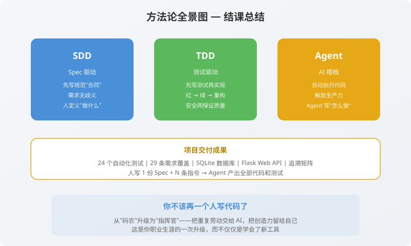

# 第10章：从登录开始，把 Agent+SDD+TDD 融入每一行代码

> **写给即将毕业的你（从这门课，不是从学校）**：恭喜你，走到这里，你已经完成了一个完整的 Agent 驱动开发项目。你不是读完了十章教程，而是**亲手指挥 AI 搭档，从一份 Spec.md 开始，构建了一个拥有 24 个自动化测试、覆盖 29 条需求、包含数据库和 Web API 的完整系统**。
>
> 这就是终章的意义——不是结束，而是你真正开始的起点。
>
---




## 10.1 回顾：你走过了怎样的一段路？

闭上眼睛，回想一下你在这十章里经历了什么：

| 章节 | 阶段 | 你做了什么 | Agent 做了什么 | TDD 循环 |
|------|------|-----------|---------------|----------|
| 第 1 章 | 认知启蒙 | 理解 SDD+TDD+Agent 三者关系 | — | — |
| 第 2 章 | 环境搭建 | 安装 Python、pytest，创建 Agent.md/Task.md | — | — |
| 第 3 章 | SDD 规格 | 撰写结构化的 Spec.md | — | 规格即契约 |
| 第 4 章 | TDD-Red | 审查 Agent 生成的测试 | 生成 15 个 pytest 测试，全部红灯 | 🔴 红灯 |
| 第 5 章 | TDD-Green | 审查 Agent 生成的最简实现 | 逐测试变绿，15 个全通过 | 🟢 绿灯 |
| 第 6 章 | 边界补强 | 让 Agent 审查覆盖并补全测试 | 发现 3 处遗漏，补充测试，18 个全绿 | 🟢补全 |
| 第 7 章 | TDD-Refactor | 审查代码坏味道，下达重构指令 | 修复类型提示、添加 `__all__`、优化 docstring | 🔄 重构 |
| 第 8 章 | 集成实战 | 下达集成指令 | 创建 database.py + app.py + 5 个集成测试 | 🔴→🟢 |
| 第 9 章 | 活文档 | 审查追溯矩阵和测试报告 | 自动生成 traceability.md + report.html | 📊 验收 |
| 第 10 章 | 山顶回顾 | 你现在在这里 | — | 🏔️ 悟道 |

这十条路，就是 Agent 驱动的 SDD+TDD 完整闭环。你不是“读”懂的，你是“指挥”懂的。你的角色从“写代码的人”变成了“定义需求 + 审查交付物的人”。这种体感，任何短视频或速成教程都给不了你。

---

## 10.2 这套方法，到底能用在哪些地方？

有同学可能会问：“我做机器学习也要写 Spec 吗？我做前端页面也要让 Agent 写测试吗？” 答案是：**核心思想通用，落地粒度因场景而异。**

### 最适合的场景（强烈推荐）

| 场景 | 为什么适合 | 示例 |
|------|-----------|------|
| **后端 API** | 输入输出明确，天然适合结构化 Spec | 登录、支付、订单、权限管理 |
| **工具库 / SDK** | 公共接口需要稳定的契约 | 图片处理库、数学计算库、API 客户端 |
| **数据处理管道** | 每个步骤的输入输出可以严格定义 | ETL 脚本、日志解析器、数据清洗 |
| **课程设计 / 竞赛** | 评分标准通常是明确的输入→输出 | OJ 题目、数据挖掘竞赛、毕业设计 |
| **多人协作项目** | Spec 是团队共识的锚点，Agent 统一风格 | 小组毕设、开源项目 |

### 需要调整粒度的场景（适度使用）

| 场景 | 建议 |
|------|------|
| **前端 UI 组件** | 不写交互细节的 Spec，但可以写“组件接收什么 props，发送什么事件”的契约 |
| **机器学习模型** | 不写“准确率必须 > 90%”这种不可控 Spec，但可以写“输入张量维度必须为 [B, 3, 224, 224]”的接口校验 |
| **游戏开发** | 不写“打击感要好”的 Spec，但可以写“角色受到攻击后 0.5 秒内进入无敌状态”的状态流转规则 |

### 不太适合的场景（放过自己，也放过 Agent）

- **一次性的探索性脚本**：比如“把这个 CSV 画个散点图看看趋势”，写完就扔。
- **纯视觉调优**：比如“这个按钮往左挪 2 像素试试”，靠眼睛看比写 Spec 快得多。
- **需求极度不确定的早期原型**：连你自己都不知道要做什么的时候，先写代码探索，想清楚了再补 Spec。

**核心判断标准**：如果一段代码**会被别人（包括未来的你）反复使用或修改**，它就值得写 Spec，让 Agent 帮你干活。

---

## 10.3 常见误区：新手最容易掉的六个坑

在陪伴你走过这十章的过程中，我一直在帮你避坑。现在我把最典型的六个坑总结出来，希望你未来自己走时能一眼识别。

### 坑一：Spec 写太细，变成“流水账”

```markdown
❌ 错误示例：
- 用户输入邮箱时，输入框下方显示灰色提示文字"请输入有效邮箱"
- 点击注册按钮后，按钮文字变为"注册中..."，同时按钮变为不可点击状态
```

这是 UI 细节，不是功能规格。Spec 应该写**“输入什么，输出什么，边界在哪”**，而不是“按钮变什么颜色”。Spec 太细会让 Agent 生成一堆无法自动验证的测试。

### 坑二：跳过人类审查，盲目信任 Agent

Agent 会犯错。它可能误解 Spec 的某一条，可能生成冗余代码，可能在重构时不小心改了行为。如果你不审查就直接合并，Bug 就会流入生产环境。**Agent 是你的手，不是你的大脑。审查是人类的最后一道防线。**

### 坑三：Task.md 太模糊，Agent 不知道从哪开始

```markdown
❌ 错误示例：
- [ ] 实现登录功能
```

Agent 看到这个会一脸茫然。Task.md 应该拆解为具体、可执行的子任务：

```markdown
✅ 正确示例：
- [ ] 编写成功登录测试（邮箱 + 密码 → 返回 JWT token）
- [ ] 编写密码错误测试（3 次后锁定 15 分钟）
```

### 坑四：重构时顺手让 Agent 加功能

```markdown
❌ 错误指令：
“Agent，帮我把密码校验逻辑重构一下，顺便加个特殊字符要求。”
```

重构 = 不改行为。加功能 = 先改 Spec → 再改测试 → 再改代码。两者混在一起，测试红了你会分不清是重构搞坏的还是新功能搞坏的。

### 坑五：测试之间有依赖

```python
# ❌ test_B 依赖 test_A 注册的邮箱
def test_A():
    register("shared@test.com", "Pass123")

def test_B():
    login("shared@test.com", "Pass123")  # 依赖 test_A 的副作用
```

如果 `test_A` 失败或被跳过，`test_B` 也会莫名其妙地红。每个测试必须**独立**，自己准备数据，自己清理数据。Agent 在生成测试时天然遵循这个原则——你审查时也要确认它没违反。

### 坑六：追求 100% 测试覆盖率

有些团队规定“测试覆盖率必须达到 95%”。这是一个危险的 KPI——它会催生出大量“为了覆盖而覆盖”的无意义测试。**测试覆盖率是手段，不是目的。** 目的是：**核心逻辑和边界条件被充分验证。** 我们在第 9 章的追溯矩阵里，覆盖率 96.6%，有一条业务规则不需要测试——这是正确的。

---

## 10.4 如何把 Agent+SDD+TDD 变成你的“肌肉记忆”？

### 起步阶段（现在到未来三个月）

- **从下一个小项目开始**：不要一上来就在 10 万行代码的老项目里引入 Agent。下一个作业、下一个 Side Project，从第一份 Spec.md 开始。
- **允许自己慢**：初期你写 Spec 的速度会下降 30%——你正在把“写代码的时间”前置到“想需求的时间”。两个月后，你的综合效率（Spec + Agent 生成 + 审查）会反超传统开发。
- **记住口诀，贴在显示器旁边**：

  > **Spec 先写清楚，Agent 自己跑红；**
  > **代码刚刚好，审查重构不能少。**

### 进阶阶段（三个月到一年）

- **学习更复杂的 Spec 写法**：当功能变复杂时，Spec 需要包含状态机图、序列图、并发场景描述。这些 Agent 都能解析。
- **引入 CI/CD**：用 GitHub Actions 或 GitLab CI，让每次推送代码时 Agent 自动运行全部测试。把“红灯不能合入主分支”变成硬规则。
- **尝试 BDD（行为驱动开发）**：BDD 是 SDD 的“表亲”，用自然语言（Gherkin 语法）写 Spec。Agent 可以直接解析 `.feature` 文件，生成对应的测试步骤。

### 高手阶段（一年以后）

- **训练你自己的 Agent 规则**：根据你团队的编码风格，定制 `Agent.md` 和 `SystemPrompt.md`。Agent 的行为会越来越像“你自己写的代码”。
- **教别人**：把你在这门课里学到的东西，讲给你的队友、学弟学妹。教是最好的学。当你不得不把“为什么 Agent 要先写测试”解释给一个初学者时，你才真正懂了它。
- **回来看这十章**：届时你会有新的理解，可能会发现当初我刻意简化的地方，也可能会有自己的改进见解。这就是成长。

---

## 10.5 从“登录”到“未来”：你的课后作业

我们以“注册”功能为核心，构建了一个完整的演示。但一个真正的登录系统，远不止注册。以下是我留给你的“课后作业”——每一个都可以用 Agent+SDD+TDD 的方式独立完成：

| # | 功能 | Spec 核心内容 | 预估测试数 |
|---|------|-------------|-----------|
| 1 | **登录** | 邮箱+密码 → JWT token；密码错误 3 次锁定 15 分钟；token 有效期 24 小时 | 12 个测试 |
| 2 | **密码重置** | 发送重置邮件 → 生成临时链接 → 新密码满足同样强度规则 | 10 个测试 |
| 3 | **用户信息接口** | 携带有效 token → 返回用户基本信息；无效/过期 token → 401 | 8 个测试 |
| 4 | **权限分级** | 普通用户 vs 管理员；部分接口仅管理员可访问 | 6 个测试 |
| 5 | **Token 黑名单** | 注销时将 token 加入黑名单；黑名单 token 不可访问任何接口 | 7 个测试 |

每一个功能，都遵循同样的节奏：

```
你写 Spec.md → Agent 写测试（红灯）→ Agent 写代码（绿灯）→ 你审查 → Agent 重构 → Agent 生成报告
```

你会发现，这不是“额外的工作”，而是**唯一能让你在复杂度增长时保持镇定**的工作方式。

---

## 10.6 最后的布道：一种新的职业身份

我想用一段有点“哲学”的话，来结束这门课程。

写代码，本质上是在**管理复杂度**。需求会变、依赖会升级、队友会离开又加入。那些只靠“感觉”和“才华”写代码的人，在系统变大的某一个临界点，会突然崩塌——改一个小地方，炸出八个 Bug，然后陷入无尽的修复循环。

传统的 SDD+TDD 给了你一套**方法论**：先定义再实现，先测试再编码。

Agent 给了你一套**加速器**：让机器去做机器擅长的事（生成代码、运行测试、维护文档），让人去做人擅长的事（定义需求、判断好坏、做出决策）。

你的新职业身份不是“码农”，而是：

> **需求定义者 × AI 指挥官 × 质量守门人**

当你习惯了这种节奏，你会发现它不仅适用于代码——写论文、做毕设、制定学习计划，甚至规划人生目标，都可以用同样的思路：

> **先定义“完成”是什么样子，再一步步验证自己正在接近它，同时让工具帮你跑完中间的每一步。**

---

## 10.7 终章小结

这一章，我们没有写新代码，也没有给 Agent 下新指令。我们做了一次“高处的俯瞰”：

- 回顾了十章完整的 Agent+SDD+TDD 旅程。
- 分析了这套方法论的适用范围和边界。
- 列举了新手最容易犯的六个错误。
- 规划了从“入门”到“高手”的精进路线。
- 提出了课后可继续实践的延伸项目。

最重要的是，我希望你带走一个信念：

> **你不是在“让 AI 替你写代码”，你是在“用 AI 放大你的决策能力”。**

这个信念，会陪伴你走过大学剩下的作业、竞赛、毕设，直到你穿上职业装走进公司的第一天——那时你会发现，你比大多数同龄人更早掌握了一项影响整个职业生涯的核心能力。

---

## 鸣谢与告别

感谢你坚持走到了第十章。编程是一门手艺，而手艺只能通过“做”来传承。如果你在跟练过程中有卡住的地方，把 Spec 拿出来重新读一遍，看是不是哪里没写清楚。如果 Spec 没问题，把测试跑一遍，看红灯在哪儿，那里就是 Agent 的下一步。

如果你想继续学习，以下是推荐的延伸资源：

- **书籍**：《Test-Driven Development: By Example》—— Kent Beck（TDD 之父的原著，薄薄一本，字字珠玑）
- **书籍**：《Refactoring: Improving the Design of Existing Code》—— Martin Fowler（重构圣经）
- **文档**：[pytest 官方文档](https://docs.pytest.org/)（比你想象的好读）
- **实践**：用 Agent+SDD+TDD 完成你的下一个课程作业，体会方法论在“非教学环境”中的威力。

---

> **最后一遍，请和我一起念：**
>
> **Spec 先写清楚，**
> **Agent 自己跑红。**
> **代码刚刚好，**
> **审查重构不能少。**
>
> **红灯不恐惧，**
> **绿灯不贪多。**
> **边界扫干净，**
> **重构胆气壮。**
>
> **人类定方向，**
> **Agent 来执行。**
> **从登录开始，**
> **到万物皆然。**

---

*你刚刚完成了 Agent 驱动的 SDD+TDD Python 登录实战教程。*  
*这不是终点，是你下一次打开终端，对 Agent 说“请读取 Spec.md，开始工作”的那一刻。*

---
