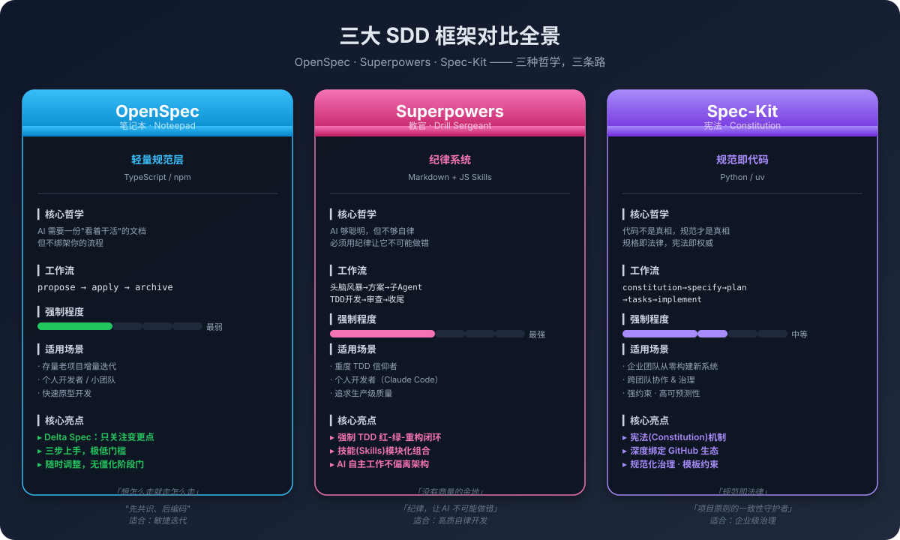
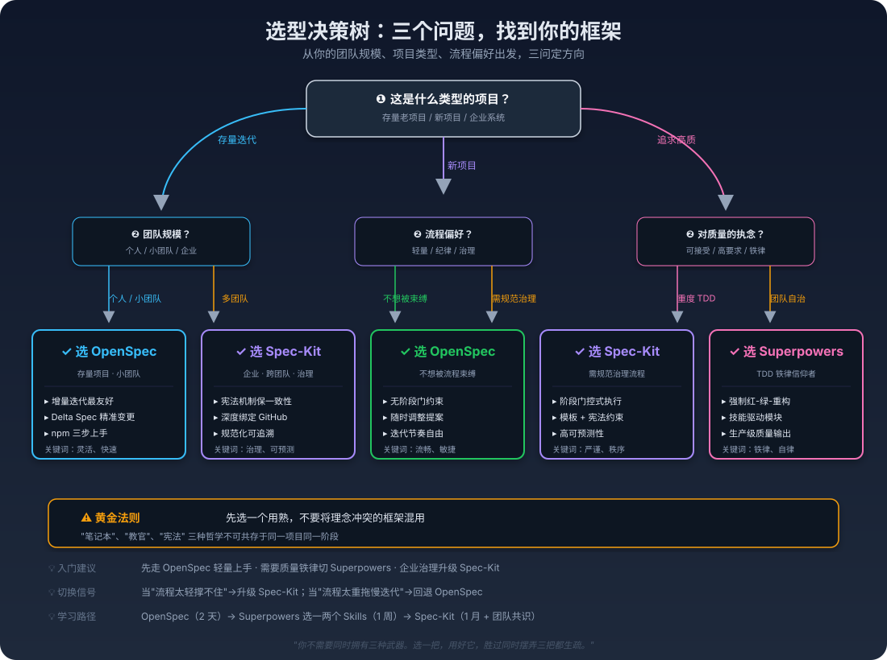

# 第11章：方法论之后，下一步——三大 SDD 框架选型指南

> **写给你这个已经学会"怎么打仗"的人**：恭喜你，走到这里，你已经完整走了一遍 Agent 驱动的 SDD+TDD 闭环——从写一份 Spec.md，到看着 24 个测试全绿，到数据库和 Web API 真正落地。

> 但一个新的问题来了：*学完了方法，你该用哪个工具？*

> 这就像你学会了"怎么开车"，现在站在汽车展厅里——面前有三辆车：一辆轻便灵活的笔记本车，一辆纪律严明的教官车，还有一辆宪法般的重型战车。**选错车，开再远也痛苦。**

> 本章，就是带你走进这个展厅。

---




## 11.1 你有没有过这样的"选型焦虑"？

想象一个场景：

你刚用 Agent+SDD+TDD 完成了一个漂亮的项目。第二天，导师（或老板）走过来问你："这套方法不错。那我们下一个项目，怎么落地？"

你脑海里立刻跳出几个名字：OpenSpec、Superpowers、Spec-Kit。你在 B 站 / GitHub 上搜了一圈，发现——

- OpenSpec 的文档说自己是"轻量笔记本"，三步就能上手；
- Superpowers 宣称自己是"AI 编程教官"，技能驱动、纪律严明；
- Spec-Kit 是 GitHub 官方出品的"规范即代码"，一套完整的宪法体系。

*三个都说自己好，三个都说别人不够好。* 你站在原地，不知道该把脚迈进哪扇门。

这不是你的问题。**这是 AI 开发工具繁荣期，几乎所有方法论学习者都会撞上的"选型墙"。**

---

## 11.2 问题背后，其实是一个更深的矛盾

为什么三款框架让人挑不出来？因为**它们表面上都在做同一件事**：

- 都说自己是"规格驱动开发（Specification-Driven Development）"；
- 都说自己要解决"需求模糊、上下文丢失、代码质量不可控"；
- 都说自己让 AI 编程变得可控、可追溯、高质量。

如果只读它们的 Slogan，你分不清——因为 **Slogan 是写给市场看的，不是写给选型人看的。**

真正的差异，藏在三个层面：

| 层面 | 表面上 | 实际上 |
|------|--------|--------|
| **哲学观** | 都是 SDD | 对"规范"的态度完全不同：笔记本 / 教官 / 宪法 |
| **强制程度** | 都"有流程" | 从"想怎么走怎么走"到"没有商量余地"，跨度极大 |
| **团队假设** | 都"适用所有人" | 它们假设的**使用者画像**完全不同 |

选框架，不是选"功能最多的"，是选**你的团队性格**能驾驭的那个。

---

## 11.3 三款框架，三种哲学的正面交锋

先给一份**全景对比表**，三目了然：

| 维度 | OpenSpec | Superpowers | Spec-Kit |
|------|----------|-------------|----------|
| **昵称** | 笔记本（Noteepad） | 教官（Drill Sergeant） | 宪法（Constitution） |
| **定位** | 轻量规范层 | 纪律系统 | 规范即代码 |
| **哲学** | "AI 需要看着干的文档，但不绑架你" | "AI 够聪明但不够自律，纪律让它不可能做错" | "代码不是真相，规范才是真相" |
| **工作流** | propose → apply → archive | 头脑风暴→方案→子 Agent TDD→审查→收尾 | constitution→specify→plan→tasks→implement |
| **强制程度** | 最弱（无阶段门） | 最强（铁律） | 中等（模板约束+宪法） |
| **技术栈** | TypeScript / npm | Markdown + JS Skills | Python / uv |
| **上手成本** | 低（npm + init，三步） | 低（插件一键） | 中（需额外 uv 等依赖） |
| **开发者** | 社区驱动 | 社区驱动（Claude Code 生态） | GitHub 官方 |

这一张表已经把"表面差异"拉出来了。但真正的价值，在下面的**正面交锋**。

### 核心定位：三种哲学，不是三种工具

这三款框架本质上是**三种对"规范"的看法**：

**OpenSpec 说："规范是笔记本。"**

> 你在迭代过程中随时写、随时改、随时看。它不约束你，它辅助你。Delta Spec（增量规范）机制让你只写"这次变了什么"，不用维护整份文档。

**Superpowers 说："规范是教官。"**

> AI 太聪明了，它能把你的指令理解成它想的方向。你必须用**纪律**去框住它——强制 TDD、强制子 Agent 隔离、强制审查关卡。没有商量的余地，因为"商量"就是质量失控的开始。

**Spec-Kit 说："规范是宪法。"**

> 代码会被改、团队会变、时间会流逝。但宪法不变。Constitution（宪法）机制确保项目原则的一致性，任何人都不能绕过。它是给治理者用的，不是给开发者用的。

**三种哲学，对应三个问题：**

| 哲学 | 它回答的问题 | 它害怕的是什么 |
|------|-------------|---------------|
| 笔记本 | "我怎么不被文档束缚？" | 流程太重，写不动 |
| 教官 | "我怎么保证 AI 不跑偏？" | AI 自由发挥，质量崩塌 |
| 宪法 | "我怎么让团队保持一致？" | 团队各自为政，标准混乱 |

> 选框架，不是选"功能最多"的，是选"它怕的东西，正好是你怕的东西"的那个。

---

## 11.4 工作流对比：同样是"写代码"，节奏天差地别

把三个框架的工作流放在同一张时间轴上，差异一目了然：

### OpenSpec：三个词走完流程

```
propose（提出变更） → apply（执行实现） → archive（归档记录）
```

- 你想调提案就调，没有"这一阶段必须完成才能进下一阶段"的门控；
- Delta Spec 让你只描述**变更点**，存量文档不用重头重写；
- 适合：你已经有项目、有代码、有方向，只是想用 Agent 高效地迭代。

**一句话**：OpenSpec 像是一个"随身的便签本"——你写什么，它记录什么，什么时候记、记多少，你说了算。

### Superpowers：七个关卡，每一关都有铁律

```
头脑风暴 → Git 隔离工作区 → 精细化方案 → 子 Agent TDD 开发
→ 系统化调试 → 代码审查 → 分支收尾
```

- 每个环节都有铁律（如**强制 TDD 红-绿-重构闭环**）；
- AI 必须自动触发并遵守技能规则，没有"这次跳过"的选项；
- 子 Agent 隔离机制让每个开发任务在独立的 Git 分支上运行，完成才合并；
- 审查关卡是硬关卡，不审查就不能合并。

**一句话**：Superpowers 像是一位"严苛的教官"——它不问你愿不愿意，它会直接执行标准流程，逼着 AI 把每一步做对。

### Spec-Kit：五个阶段，有模板也有门

```
constitution（立宪）→ specify（规范）→ plan（计划）→ tasks（任务拆解）→ implement（实现）
```

- Constitution（宪法）是所有开发的**顶层约束**，定义项目原则；
- 有模板约束，有宪法合规要求，建议按顺序执行；
- 比 Superpowers 宽松，但比 OpenSpec 严谨得多；
- 适合从零开始构建需要强约束的新系统。

**一句话**：Spec-Kit 像是一部"项目宪法"——它不直接管你每一行代码怎么写，但它规定了"整个项目必须遵守的原则"。

### 三种工作流的本质差异

| 维度 | OpenSpec | Superpowers | Spec-Kit |
|------|----------|-------------|----------|
| **节奏** | 你来定 | 框架定 | 建议顺序，可调整 |
| **阶段门** | 无 | 硬关卡 | 软关卡 |
| **AI 自主度** | 高（你指挥） | 低（框架约束） | 中（模板引导） |
| **人类介入点** | 随时 | 规定点（审查时） | 规定点 + 自定义 |

---

## 11.5 原理拆解：为什么三个框架不能混用？

理解了三个框架**各自的哲学**，你就能理解为什么**不能混用**。

### 哲学层面的冲突

想象三个场景：

**场景一：你先用 Superpowers 建立了"铁律纪律"。**

然后某天你觉得"这太严了，让我用 OpenSpec 改个需求吧。"——问题来了：Superpowers 的工作流是"必须 TDD 闭环"，OpenSpec 的工作流是"随时改提案"。同一个项目里，两个流程交替出现，结果是——**测试没跑、需求没追溯、代码改乱了**。

**场景二：你用 Spec-Kit 立了"宪法"。**

然后你想"这个功能比较简单，用 Superpowers 的快速通道做吧。"——Spec-Kit 要求所有变更符合宪法，Superpowers 的"快速通道"可能绕过了宪法审查。结果是——**你的"宪法"成了摆设**。

**场景三：你用 OpenSpec 做增量迭代。**

然后你觉得"团队越来越大，需要规范化了"，直接切到 Spec-Kit。——OpenSpec 的 Delta Spec 和 Spec-Kit 的 Constitution 是两个**完全不同粒度的治理机制**，简单切换会让存量文档无法兼容。

> **核心理由**：三个框架不是"工具版本"的差异，是"治理哲学的差异"。你不可能同时做"纪律严明"和"随意自在"——**你的项目只能有一种治理气质**。

### 技术层面的冲突

| 冲突维度 | 具体表现 |
|----------|---------|
| **文档格式不兼容** | OpenSpec 用 Markdown+YAML，Spec-Kit 有 Constitution 模板，格式不同 |
| **工作流冲突** | Superpowers 强制 Git 分支隔离，Spec-Kit 是阶段门控，节奏不同 |
| **审查关卡不同** | Superpowers 的审查是硬关卡，Spec-Kit 是软关卡，混用会混乱 |
| **AI 角色假设不同** | OpenSpec 中 AI 是被指挥者，Superpowers 中 AI 是被约束者，Spec-Kit 中 AI 是受模板引导者 |

---

## 11.6 效果对比：三个框架到底适合谁？

| 维度 | OpenSpec | Superpowers | Spec-Kit |
|------|----------|-------------|----------|
| **上手时间** | 2–4 小时 | 半天（插件安装） | 1–2 天（学习曲线陡） |
| **存量项目友好度** | ⭐⭐⭐⭐⭐ 极高 | ⭐⭐ 较低 | ⭐⭐⭐ 中等 |
| **新手个人开发者** | ⭐⭐⭐⭐⭐ 推荐 | ⭐⭐⭐⭐ 推荐 | ⭐⭐⭐ 可选 |
| **TDD 质量追求** | ⭐⭐⭐ 一般 | ⭐⭐⭐⭐⭐ 极高 | ⭐⭐⭐⭐ 较高 |
| **团队协作治理** | ⭐⭐ 弱 | ⭐⭐⭐ 中等 | ⭐⭐⭐⭐⭐ 强 |
| **企业级场景** | ⭐⭐ 弱 | ⭐⭐⭐ 中等 | ⭐⭐⭐⭐⭐ 强 |
| **学习曲线** | 低 | 低 | 中高 |

> **核心数据**：三个框架没有"谁更好"，只有"谁更合适你的场景"。选错框架的学习成本，往往比你多花一个月时间重写还贵。

---

## 11.7 实践指南：从三个问题找到你的答案


### 问题一：你的项目类型是什么？

| 项目类型 | 推荐 |
|----------|------|
| 存量老项目，已有代码和文档 | **OpenSpec**（增量迭代最友好） |
| 从零开始的新项目，个人/小团队 | **OpenSpec** 或 **Superpowers** |
| 从零开始的新项目，企业团队 | **Spec-Kit** |
| 快速原型 / 验证想法 | **OpenSpec** |

### 问题二：你的团队规模多大？

| 团队规模 | 推荐 |
|----------|------|
| 1 人 | **OpenSpec** 或 **Superpowers** |
| 2–5 人 | **OpenSpec**（轻量）或 **Superpowers**（纪律） |
| 5 人以上 / 多团队 | **Spec-Kit**（治理刚需） |

### 问题三：你对流程的偏好是什么？

| 偏好 | 推荐 |
|------|------|
| "我想自由迭代，不被流程困住" | **OpenSpec** |
| "我想确保 AI 不跑偏，质量第一" | **Superpowers** |
| "我需要规范化的团队治理" | **Spec-Kit** |

### 三步动手实践

**第一步：先选一个。**

> 如果不确定，选 **OpenSpec**。它门槛最低，你以后想升级到 Spec-Kit 也最顺畅。

**第二步：用一个完整项目跑通它。**

> 不要只在玩具项目里试。选一个你**真正需要交付**的项目，完整走一遍流程，记录你的感受：*是太轻了撑不住，还是太重了拖慢你？*

**第三步：根据感受决定是否切换。**

> - 觉得"太轻，AI 乱来"→ 切 **Superpowers** 的特定 Skills（不用全切）；
> - 觉得"团队需要治理"→ 升级 **Spec-Kit**；
> - 觉得"刚刚好"→ 继续用，深耕它。

---

## 11.8 最后的布道：一把武器，用好它

我在这十章课程里，一直强调"SDD+TDD+Agent"的**方法论**。但方法论只是地图，框架才是真正的**车辆**。

你不需要同时拥有三辆车。你需要的是：

> **选一辆，熟悉它的脾气，开遍所有你想去的地方。**

OpenSpec 不是比 Superpowers 差，它只是解决一个不同的问题。Spec-Kit 不是比 OpenSpec 高级，它只是服务于一个不同的团队。

**方法论的本质是"先想清楚，再动手"。** 选框架也不例外——

- 先想清楚你的**团队是谁**；
- 再想清楚你的**项目是什么**；
- 最后选一个**气质和你的团队匹配**的框架。

> **不要选"最出名"的，选"最对劲"的。**

---

## 本章小结

这一章，我们没有写代码，也没有让 Agent 做任何事。我们做了一次"**选型决策**"：

- 认识了三大 SDD 框架：**OpenSpec（笔记本）、Superpowers（教官）、Spec-Kit（宪法）**；
- 理解了它们的核心哲学差异：**对"规范"的态度完全不同**；
- 对比了它们的工作流、强制程度、技术栈和适用场景；
- 明白了为什么**三个框架不能混用**；
- 给出了三个问题、三个步骤的**选型指南**。

最重要的是，我希望你带走一个判断标准：

> **选框架，不是选"功能最多"的，是选"它怕的东西，正好是你怕的东西"的那个。**

---

## 扩展阅读与实践

- **[OpenSpec 官方文档](https://github.com/OpenSpec/open-spec)** — 了解 Delta Spec 的增量规范机制
- **[Superpowers（社区）](https://github.com/superpowers-ai)** — 查看技能库中的 TDD 技能
- **[Spec-Kit（GitHub 官方）](https://github.com/github/spec-kit)** — 了解 Constitution 机制和 GitHub 生态集成
- **动手任务**：选一个你在第 10 章留下的课后作业（登录、密码重置、权限分级），用你选定的框架重新走一遍完整流程，对比"用框架"和"不用框架"的体验差异。

---

> **最后一句，请和我一起念：**
>
> **笔记本记录增量，**
> **教官守住纪律。**
> **宪法约束团队，**
> **选对，胜过选多。**
>
> **方法论是你的地图，**
> **框架是你的车轮。**
> **选一辆，开下去，**
> **比停在展厅里强。**

---

*本章是"方法论之后"的延伸篇。它不教你新技能，它教你怎么选。选对了框架，你前面学的 SDD+TDD+Agent 才能在你真正的业务里发挥威力。*

---
