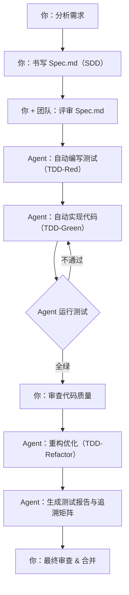

# 第1章：别急着写代码——认识你的 AI 搭档与 SDD+TDD

> **写给正在掉头发的你**：你有没有过这样的经历？通宵写完一个“用户登录”功能，第二天测试同学给你报了七八个 Bug：邮箱没校验、密码没限制、重复注册没拦截……你一边改一边嘀咕：“需求又没说清楚！”
>
> 如果我告诉你，从今天开始，你不再是一个人战斗了——你有一个 **AI 搭档**，它能读懂你写的“合同”，自动帮你写测试、写代码、甚至重构。而你，只需要做两件事：**把需求说清楚，把结果审一遍。**
>
> 这就是本章要带你认识的新工作方式：**Harmes Agent 驱动的 SDD+TDD 开发模式**。

---

## 1.1 三个故事，三种人生

### 小明的故事（没有方法论，没有 AI）
小明接到作业：“写一个登录注册功能。”他打开 VS Code 就开始干。写完发现邮箱没校验，补上；又发现密码太短，再补；最后代码成了一锅粥，改一个地方就担心别的地方崩掉。提交后，助教反馈：“你这里重复邮箱的提示信息不对啊！”小明心里苦：“你之前也没说要返回什么错误码啊……”

### 小红的故事（有方法论，没有 AI）
小红先花 15 分钟写了一份**规格文档**，把邮箱格式、密码规则、各种错误情况都列得清清楚楚。然后她**先写测试**，看着测试失败（一片红），再从容地写出让测试通过的代码。最后，她甚至大胆地重构了代码结构，因为测试这个“安全网”会告诉她有没有改出问题。最终，她的代码几乎没有 Bug，还特别容易看懂。

### 小蓝的故事（有方法论，也有 AI 搭档）
小蓝也先写了一份规格文档，但她写的是 **Spec.md**——一份结构化的、AI 能读懂的“合同”。然后她对 AI 搭档说：“这是需求，先帮我写测试。”AI 在 30 秒内生成了 15 个 pytest 测试用例，全部红灯。小蓝又说：“现在帮我写代码，让测试变绿。”AI 又生成了核心实现代码，15 个测试全部通过。小蓝最后说：“帮我重构一下，提取常量，拆分函数。”AI 照做了，测试依然全绿。

**小蓝写代码了吗？几乎没有。** 但他做了更重要的事：**定义“做什么”和“怎么算做对了”**。代码是 AI 写的，但**质量是小蓝的**。

你想做小明、小红，还是小蓝？这门课，让你成为小蓝。

---

## 1.2 基础概念：三个名词，改变你的编程生涯

### 1.2.1 SDD：还没写代码，先写“契约”

**SDD（Specification-Driven Development，规格驱动开发）** 是一种 **“先定义再实现”** 的开发方法。在写任何代码之前，我们先产出一份**功能规格说明书**，它就像是功能的“合同”或“契约”，规定了：

- **输入**是什么，长什么样，有哪些限制
- **输出**在成功时给什么，失败时又是什么错误信息
- **边界条件**：极端情况、异常情况怎么办
- **业务规则**：核心的计算逻辑或状态变化

SDD 的核心原则很简单，也很有力：

- **先定义再实现**：不写没有规格的代码
- **规格即契约**：任何变更必须先更新规格，再改代码
- **可验证性**：规格里不能有“差不多”、“大概”、“适当”这种废话，必须能测试

> 想象一下：你要装修房子，是先画设计图，还是直接抡锤子砸墙？SDD 就是那张设计图。

### 1.2.2 TDD：让测试成为你的“安全带”

**TDD（Test-Driven Development，测试驱动开发）** 由 Kent Beck 老爷子提出，节奏感极强，跟着三个节拍跳舞：

1. **红（Red）**：先写一个会失败的测试用例。这个测试就是你对代码的期待。
2. **绿（Green）**：编写**刚好**能让测试通过的最简单代码。别多想，别过度设计。
3. **重构（Refactor）**：在测试全部通过的“绿色保护”下，优化代码结构，让它更美、更清晰。

TDD 就像赛车手的安全带。有了它，你才敢在重构的赛道上飙车，因为每次微调，测试都会自动告诉你：“没翻车，继续开！”或者“翻车了，快回退！”

### 1.2.3 Harmes Agent：你的 AI 搭档

**Harmes Agent** 是一个 AI 开发助手，它能：

- **读懂**你写的 Spec.md（结构化规格文档）
- **自动生成**符合规格的 pytest 测试用例
- **自动编写**刚好让测试通过的最简实现代码
- **自动执行**代码重构优化
- **自动维护**需求追溯矩阵和测试报告

但有一件事它**不做**：定义需求。这件事，只有你能做。**Agent 是你的手，Spec.md 是你的脑。**

---

## 1.3 一张表看懂三者的分工

| 维度 | SDD（规格驱动） | TDD（测试驱动） | Harmes Agent |
| :--- | :--- | :--- | :--- |
| **关注点** | **做什么（What）** | **做得对不对（How）** | **自动执行循环** |
| **产出物** | Spec.md 规格文档 | 测试用例 + 实现代码 | 测试+代码+报告（自动生成） |
| **谁来做** | 你（人类） | 你 + Agent 协作 | Agent 自动执行 |
| **编写时机** | 编码之前 | 编码过程中 | 你定义任务后 |
| **核心价值** | 需求正确性 | 实现正确性 | 效率 ×10，质量不减 |

看到这张表了吗？SDD 负责**方向**，TDD 负责**验证**，Agent 负责**执行**。你的角色，从一个“码农”升级成了一个“指挥官”。

---

## 1.4 SDD + TDD + Agent 结合工作流

以后我们写 Python 登录功能，就会反复走下面这个流程。现在你可以先把它理解为一种“三人舞蹈”：



注意这个流程中的分工：

| 步骤 | 谁来做 | 做什么 |
|------|--------|--------|
| 分析需求 | **你** | 理解用户想要什么 |
| 写 Spec.md | **你** | 把需求翻译成结构化规格 |
| 评审 Spec | **你 + 团队** | 确保需求理解一致 |
| 写测试 | **Agent** | 根据 Spec 自动生成 pytest 用例 |
| 写代码 | **Agent** | 写刚好通过测试的最简实现 |
| 运行测试 | **Agent** | 自动运行，全绿才进入下一步 |
| 审查代码 | **你** | 确认代码符合你的预期 |
| 重构 | **Agent** | 优化代码结构，测试保持全绿 |
| 生成报告 | **Agent** | 自动生成 HTML 报告 + 追溯矩阵 |
| 最终审查 | **你** | 验收，合并到主分支 |

**你写的是“合同”，Agent 写的是“交付物”。**

---

## 1.5 登录规格初体验：一份 Agent 可读的 Spec.md 长什么样？

假设我们要做一个最简单的**用户登录**功能（以邮箱和密码登录）。在你对 Agent 说任何话之前，我们先写一份它看得懂的迷你 Spec.md。这只需要简单的 Markdown + YAML 头部：

```markdown
---
spec:
  name: 用户注册功能
  version: 1.0.0
  status: draft
---

# 用户注册功能规格

## 功能描述
提供用户注册能力。用户通过邮箱和密码完成注册，返回用户标识和邮箱信息。

## 输入参数

### email
- 类型: string
- 必填: true
- 约束: 符合邮箱格式（含 @），长度 ≤ 255，自动去首尾空格并转小写

### password
- 类型: string
- 必填: true
- 约束: 长度 8–64，至少包含一个字母和一个数字

## 输出结果

### 成功（HTTP 201）
{
  "userId": "UUID v4 自动生成",
  "email": "规范化后的邮箱"
}

### 失败（HTTP 4xx）

| 错误码 | HTTP 状态码 | 触发条件 |
|--------|-------------|----------|
| INVALID_EMAIL_FORMAT | 400 | 邮箱格式非法或长度超限 |
| PASSWORD_TOO_SHORT | 400 | 密码长度 < 8 |
| PASSWORD_TOO_LONG | 400 | 密码长度 > 64 |
| WEAK_PASSWORD | 400 | 密码不含字母或数字 |
| EMAIL_ALREADY_REGISTERED | 409 | 邮箱已被注册 |

## 边界条件
- 邮箱长度刚好 255 字符：允许注册
- 邮箱长度超过 255 字符：拒绝
- 密码刚好 8 位：允许
- 密码刚好 64 位：允许
- 邮箱含首尾空格和大写字母：自动规范化
```

> 你看，这份文档就是给 Agent 看的“合同”。有了它，Agent 就知道你要什么，然后自动帮你写测试、写代码。而你要做的，就是确保这份合同**写得对**。

---

## 1.6 这种新模式的三大优势

### 1.6.1 效率 ×10，质量不减

传统开发：你写测试（30 分钟）→ 你写代码（1 小时）→ 你重构（30 分钟）≈ 2 小时。
Agent 开发：你写 Spec（20 分钟）→ Agent 写测试+代码+重构（3 分钟）→ 你审查（15 分钟）≈ 38 分钟。

**你把时间花在了“思考”上，而不是“打字”上。**

### 1.6.2 需求追溯，自动生成

以前，你需要手动维护一份“需求 → 测试 → 代码”的追溯矩阵。现在，Agent 在生成测试和代码的同时，**自动维护这份矩阵**。任何时候你想知道“这个 Bug 对应哪条需求”，打开 `traceability.md` 就够了。

### 1.6.3 文档永不“过时”

传统项目里，代码改了但文档没改是常态。但在 Agent 模式下，**Spec.md 是唯一的真相来源**。如果代码不符合 Spec，测试会红，Agent 会修复。如果你改了 Spec，Agent 会重新生成测试和代码。文档和代码永远是同步的。

---

## 1.7 什么场景最适合用？这门课的场景就是其中之一！

- **后端 API 开发**：输入输出明确，最适合写 Spec，让 Agent 实现。
- **对正确性要求极高的系统**：金融、医疗、考试系统，每一条规则都可追溯到 Spec 的一条。
- **课程设计 / 竞赛项目**：你有明确的需求文档（或作业要求），直接翻译成 Spec，让 Agent 帮你写代码和测试。
- **多人协作**：Spec.md 是团队的共同语言，Agent 保证所有人的实现风格一致。

**当然，也有几根“温柔的刺”要注意：**
- **你不会写代码也没关系，但你得会写 Spec**：Spec 的好坏直接决定了 Agent 产出的质量。Garbage in, garbage out。
- **你必须审查 Agent 的产出**：Agent 会犯错。它写的代码可能符合 Spec 但结构不够好，你需要做最终的“代码审查者”。
- **别走火入魔**：像按钮动画、页面阴影这种 UI 细节，别写 Spec 了，直接自己调。Spec 最适合的是**逻辑密集型**的功能。

---

## 1.8 这门课会带你经历什么？

在接下来的 10 章里，你将：

1. 搭好 Python 实验台和 Agent 配置（第 2 章）
2. 写一份完整的、Agent 可读的 Spec.md（第 3 章）
3. 看着 Agent 自动生成 15 个红灯测试（第 4 章）
4. 看着 Agent 逐个让测试变绿（第 5 章）
5. 让 Agent 补全边界测试，织密安全网（第 6 章）
6. 审查 Agent 的代码，并让它重构优化（第 7 章）
7. 让 Agent 集成数据库和 Web 框架（第 8 章）
8. 让 Agent 自动生成测试报告和追溯矩阵（第 9 章）
9. 把这一切方法论带走，用到你未来的每一个项目里（第 10 章）
10. 拿到完整的项目文件清单，随时可以复制运行（第 11 章）

---

## 本章小结

这一章我们没写一行代码，但你认识了一个新朋友——**Harmes Agent**，以及它和 SDD、TDD 的“三角关系”。

- **SDD** 回答：“我们要构建什么？”（你写 Spec.md）
- **TDD** 回答：“我们构建的是正确的东西吗？”（Agent 写测试）
- **Agent** 回答：“我来帮你写测试、写代码、重构、出报告。”（自动执行）

你的新角色是：**需求定义者 + 代码审查者**。Agent 是你的手，Spec.md 是你的脑，TDD 是你的安全带。

最后，请记住这门课将要反复念诵的新口诀：

> **Spec 先写清楚，Agent 自己跑红；**
> **代码刚刚好，审查重构不能少。**

下一章，我们就卷起袖子，搭好 Python 实验台，并配置我们的 AI 搭档——创建 Agent.md、Task.md，让它真正“认识”我们、了解我们的项目。你准备好了吗？

---
