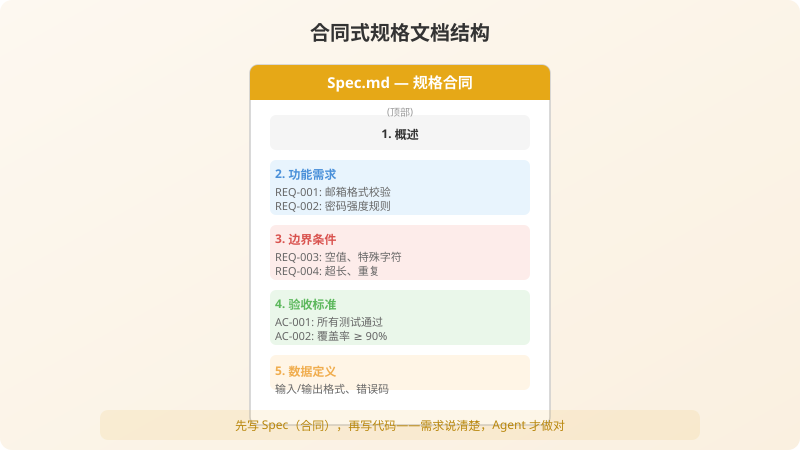
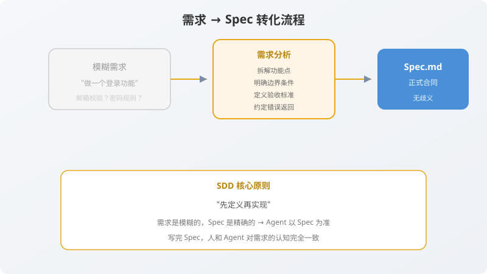

# 第3章：不写代码，先写“合同”——编写 Agent 可读的 Spec.md

> **写给正在磨笔的你**：前两章我们聊了心法，搭了环境，还创建了三份 Agent 配置文件。你大概在想：“现在可以对 Agent 说话了吧！”——还差最后一步，也是整个 SDD+TDD+Agent 模式中最关键的一步：**写一份 Agent 能精确读懂的 Spec.md**。
>
> 又必须足够结构化，让 Agent 能逐条翻译成测试断言。本章，我们就来写这份合同。
>
---




## 3.1 好 Spec vs. 坏 Spec：Agent 眼中的天壤之别

你肯定见过（甚至写过）这样的“需求描述”：

> “做一个注册功能，用户填邮箱和密码，能注册就行。”

这就是**坏 Spec**。你如果把它丢给 Agent，Agent 会一脸茫然——它会开始猜：邮箱要不要校验？密码多长算合法？重复注册怎么办？返回什么格式？猜着猜着，就猜出一个和你预期完全不同的东西。

**好 Spec** 则像一个精密图纸，条目清晰、无歧义、可验证。Agent 读完就能直接开工，不需要任何追问。

| 维度 | 坏 Spec | 好 Spec |
|------|--------|--------|
| 邮箱 | “填邮箱” | 必填，需含 @，长度 ≤ 255，去首尾空格转小写 |
| 密码 | “填密码” | 必填，长度 8–64，至少含一个字母和一个数字 |
| 成功 | “成功就行” | 返回 `{"userId": "uuid", "email": "xxx@example.com"}` |
| 重复注册 | 没说 | 返回错误码 `EMAIL_ALREADY_REGISTERED` |
| 校验失败 | 没说 | 分别返回 `INVALID_EMAIL_FORMAT`、`PASSWORD_TOO_SHORT`、`WEAK_PASSWORD` |

**好 Spec 的三大金标准**：
1. **明确**：没有“大概”、“可能”、“适当”这些词。
2. **无歧义**：任何两个程序员（或 Agent）读完后，会生成相同的测试。
3. **可验证**：每一个条目都能直接翻译成一个 `assert` 断言。

---

## 3.2 Spec.md 的结构：四个必备模块

一份 Agent 可读的 Spec.md，必须包含以下四个模块：

| 模块 | 作用 | 如果缺失会怎样 |
|------|------|--------------|
| **元数据头** | 告诉 Agent 这份规格的基本信息（名称、版本、状态） | Agent 无法判断规格是否已冻结 |
| **功能描述** | 一句话概括这个功能做什么 | Agent 缺少全局视角，容易跑偏 |
| **输入/输出定义** | 精确定义每个参数的类型、约束、示例 | Agent 会自己编造参数规则 |
| **边界条件与业务规则** | 定义极端情况下的行为和底层约束 | Agent 只测“阳光路径”，Bug 全留在边界上 |

下面，我们逐一展开。

---

## 3.3 模块一：元数据头（YAML Front Matter）

Spec.md 的开头是一段 YAML 格式的元数据，用 `---` 包裹。它不是给人类看的花架子，而是给 Agent 的“快速索引”——Agent 可以解析它来确定规格是否冻结、属于哪个模块、优先级如何。

```yaml
---
spec:
  name: 用户注册功能
  version: 1.0.0
  status: approved          # draft | review | approved | deprecated
  owner: product-team
  created: 2025-01-15
  updated: 2025-01-20
  tags:
    - authentication
    - user-management
    - registration
---
```

**各字段的含义**：

| 字段 | 类型 | 说明 |
|------|------|------|
| `name` | string | 功能名称，简明扼要 |
| `version` | string | 语义化版本，变更时递增 |
| `status` | enum | `draft`（草稿）、`review`（评审中）、`approved`（已冻结）、`deprecated`（已废弃） |
| `owner` | string | 负责团队或个人 |
| `created` | date | 创建日期 |
| `updated` | date | 最后更新日期 |
| `tags` | list | 便于按模块筛选 |

> **布道师碎碎念**：`status` 字段极其重要。Agent 应该只实现 `approved` 状态的规格。如果还是 `draft`，Agent 应该拒绝生成实现代码，只生成试探性的测试。这是一种“安全锁”。

---

## 3.4 模块二：功能描述

用一句话说清楚这个功能是干什么的。不要写“怎么做”，只写“做什么”。

```markdown
## 功能描述

提供用户注册能力。
用户通过提供符合格式的邮箱和符合安全规则的密码，创建一个新的用户账户。
注册成功后返回用户唯一标识和规范化后的邮箱信息。
注册不触发自动登录（功能分离）。
```

注意这三句话分别回答了三个问题：
1. **核心动作**：创建用户账户
2. **输入约束**：邮箱和密码需符合规则
3. **输出范围**：只返回 ID 和邮箱，不包含 token

---

## 3.5 模块三：输入/输出定义（含错误码）

这是整份 Spec.md 中最关键的部分。Agent 会根据这个模块生成**所有测试用例的参数化数据**和**所有异常处理的错误码逻辑**。

### 3.5.1 输入参数

```markdown
## 输入参数

### email
- **类型**: `string`
- **必填**: 是
- **约束**:
  1. 必须包含 `@` 符号（符合邮箱基本格式）
  2. 长度不得超过 255 字符
  3. 首尾空格自动去除
  4. 统一转换为小写字母
- **示例（合法）**: `"user@example.com"`, `"  User@Example.com  "`
- **示例（非法）**: `"notanemail"`, `""`（空字符串）, `"a"*256 + "@example.com"`
- **校验失败错误码**: `INVALID_EMAIL_FORMAT`

### password
- **类型**: `string`
- **必填**: 是
- **约束**:
  1. 长度: 8 ≤ len ≤ 64 字符
  2. 至少包含 1 个英文字母 (a-z, A-Z)
  3. 至少包含 1 个数字 (0-9)
  4. 首尾空格视为密码的一部分（不做自动去除）
- **示例（合法）**: `"SecurePass123"`, `"Abcdefg1"`（刚好 8 位）
- **示例（非法）**: `"Abc1234"`（7 位）, `"abcdefgh"`（无数字）, `"12345678"`（无字母）
- **校验失败错误码**:
  - 长度不足 8: `PASSWORD_TOO_SHORT`
  - 长度超过 64: `PASSWORD_TOO_LONG`
  - 不含字母或数字: `WEAK_PASSWORD`
```

> **Agent 如何解析这个**：当 Agent 读到 `password` 的约束时，它会自动生成三个参数化测试用例：
> - `("short@test.com", "Abc1234", "PASSWORD_TOO_SHORT")`
> - `("long@test.com", "A"*65 + "1", "PASSWORD_TOO_LONG")`
> - `("nodigit@test.com", "abcdefgh", "WEAK_PASSWORD")`
>
> 这就是“规格直接翻译成测试”的魔力。

### 3.5.2 输出结果

```markdown
## 输出结果

### 成功响应

- **HTTP 状态码**: `201 Created`
- **响应体**:
```json
{
  "userId": "自动生成的 UUID v4 字符串",
  "email": "规范化后的邮箱地址（小写、无首尾空格）"
}
```

### 失败响应

所有失败响应遵循统一格式：
```json
{
  "error": "ERROR_CODE（大写蛇形命名）",
  "message": "人类可读的错误描述"
}
```

| 错误码 | HTTP 状态码 | 触发条件 | 含义 |
|--------|-------------|----------|------|
| `INVALID_EMAIL_FORMAT` | 400 | 邮箱不包含 @ 或长度超过 255 | 邮箱格式非法 |
| `PASSWORD_TOO_SHORT` | 400 | 密码长度 < 8 | 密码过短 |
| `PASSWORD_TOO_LONG` | 400 | 密码长度 > 64 | 密码过长 |
| `WEAK_PASSWORD` | 400 | 密码不满足字母+数字的组合要求 | 密码强度不足 |
| `EMAIL_ALREADY_REGISTERED` | 409 | 邮箱已被注册（不区分大小写） | 邮箱重复 |
```

> **Agent 如何解析这个**：Agent 会为每个错误码生成一个 `with pytest.raises(ValueError, match="ERROR_CODE")` 的测试。HTTP 状态码会被映射到 Flask API 层的 `return jsonify(...), status_code`。

---

## 3.6 模块四：边界条件与业务规则

### 3.6.1 边界条件

边界是 Bug 的温床，也是 Agent 最容易遗漏的地方。必须在 Spec 中显式列出来。

```markdown
## 边界条件

| # | 场景 | 输入 | 预期结果 |
|---|------|------|---------|
| B1 | 邮箱刚好 255 字符 | 构造一个 255 字符的合法邮箱 | 注册成功 |
| B2 | 邮箱 256 字符 | 构造一个 256 字符的邮箱 | `INVALID_EMAIL_FORMAT` |
| B3 | 密码刚好 8 位 | `"Abcdefg1"` | 注册成功 |
| B4 | 密码刚好 64 位 | `"A"*63 + "1"` | 注册成功 |
| B5 | 密码 7 位 | `"Abc1234"` | `PASSWORD_TOO_SHORT` |
| B6 | 密码 65 位 | `"A"*65 + "1"` | `PASSWORD_TOO_LONG` |
| B7 | 密码含空格 | `"Valid 1 Password"` | 注册成功（空格是合法字符） |
| B8 | 邮箱含首尾空格和大写 | `"  User@Example.com  "` | 规范化为 `"user@example.com"`，注册成功 |
| B9 | 同一邮箱重复注册 | 两次使用相同邮箱 | 第二次返回 `EMAIL_ALREADY_REGISTERED` |
| B10 | 邮箱大小写不同 | `"USER@EXAMPLE.COM"` 和 `"user@example.com"` | 视为同一邮箱 |
```

### 3.6.2 业务规则

```markdown
## 业务规则

1. **密码存储**: 必须使用 bcrypt 哈希算法，数据库禁止存储明文密码。
2. **用户 ID**: 使用 UUID v4 算法自动生成，确保全局唯一。
3. **功能分离**: 注册成功后不自动登录，token 不在此功能范围内。
4. **邮箱唯一性**: 不区分大小写，规范化后再查重。
5. **并发处理**: 依赖数据库 UNIQUE 约束保证邮箱唯一，并发注册同一邮箱时仅一个成功。
```

---

## 3.7 完整 Spec.md：一次看全貌

把上面四个模块整合起来，就是我们项目最终的 `docs/Spec.md`。Agent 拿到这份文件后，不需要任何额外解释，就能开始工作了。

```markdown
---
spec:
  name: 用户注册功能
  version: 1.0.0
  status: approved
  owner: product-team
  created: 2025-01-15
  updated: 2025-01-20
  tags:
    - authentication
    - user-management
    - registration
---

# 用户注册功能规格

## 功能描述

提供用户注册能力。
用户通过提供符合格式的邮箱和符合安全规则的密码，创建一个新的用户账户。
注册成功后返回用户唯一标识和规范化后的邮箱信息。
注册不触发自动登录（功能分离）。

## 输入参数

### email
- **类型**: `string`
- **必填**: 是
- **约束**:
  1. 必须包含 `@` 符号
  2. 长度不得超过 255 字符
  3. 首尾空格自动去除
  4. 统一转换为小写字母
- **合法示例**: `"user@example.com"`, `"  User@Example.com  "`
- **非法示例**: `"notanemail"`, `""`, `"a"*256 + "@example.com"`
- **错误码**: `INVALID_EMAIL_FORMAT`

### password
- **类型**: `string`
- **必填**: 是
- **约束**:
  1. 长度: 8 ≤ len ≤ 64
  2. 至少包含 1 个英文字母
  3. 至少包含 1 个数字
  4. 首尾空格不做自动去除
- **合法示例**: `"SecurePass123"`, `"Abcdefg1"`（刚好 8 位）
- **非法示例**: `"Abc1234"`（7 位）, `"abcdefgh"`（无数字）, `"12345678"`（无字母）
- **错误码**:
  - `PASSWORD_TOO_SHORT`（长度 < 8）
  - `PASSWORD_TOO_LONG`（长度 > 64）
  - `WEAK_PASSWORD`（不含字母或数字）

## 输出结果

### 成功响应
- **HTTP 状态码**: `201 Created`
- **响应体**:
```json
{
  "userId": "UUID v4 字符串",
  "email": "规范化后的邮箱（小写、无首尾空格）"
}
```

### 失败响应
- **格式**:
```json
{
  "error": "ERROR_CODE",
  "message": "人类可读描述"
}
```

| 错误码 | HTTP 状态码 | 触发条件 |
|--------|-------------|----------|
| `INVALID_EMAIL_FORMAT` | 400 | 邮箱不含 @ 或长度 > 255 |
| `PASSWORD_TOO_SHORT` | 400 | 密码长度 < 8 |
| `PASSWORD_TOO_LONG` | 400 | 密码长度 > 64 |
| `WEAK_PASSWORD` | 400 | 密码不含字母或数字 |
| `EMAIL_ALREADY_REGISTERED` | 409 | 邮箱已存在（不区分大小写） |

## 边界条件

| # | 场景 | 输入 | 预期结果 |
|---|------|------|---------|
| B1 | 邮箱刚好 255 字符 | 255 字符的合法邮箱 | 成功 |
| B2 | 邮箱 256 字符 | 256 字符的邮箱 | `INVALID_EMAIL_FORMAT` |
| B3 | 密码刚好 8 位 | `"Abcdefg1"` | 成功 |
| B4 | 密码刚好 64 位 | `"A"*63 + "1"` | 成功 |
| B5 | 密码含空格 | `"Valid 1 Password"` | 成功 |
| B6 | 邮箱含首尾空格和大写 | `"  User@Example.com  "` | 规范化为小写 |
| B7 | 重复注册 | 两次相同邮箱 | 第二次 409 |
| B8 | 大小写不同视为同一邮箱 | `"A@B.COM"` 和 `"a@b.com"` | 视为重复 |

## 业务规则

1. 密码使用 **bcrypt** 哈希存储，禁止明文
2. 用户 ID 使用 **UUID v4** 生成
3. 注册成功不自动登录
4. 邮箱唯一性不区分大小写
5. 依赖数据库 UNIQUE 约束处理并发
```

---

## 3.8 这份 Spec.md 凭什么能省下 10 小时返工？

写完这份 Spec，你可能已经感受到了：**写 Spec 比写代码还累**。但正是这份“累”，帮你提前预演了所有可能的分支。

- **没有 Spec**：Agent 猜着写，你审着改，来回拉锯 5 轮，每轮 30 分钟 = 2.5 小时。
- **有 Spec**：你花 30 分钟写 Spec，Agent 花 3 分钟生成测试+代码，你花 15 分钟审查。总计 48 分钟。**而且结果是 100% 符合你预期的。**

更重要的是，这份 Spec.md 是**可复用的资产**：
- 下个学期做类似功能，直接复制改几行
- 团队合作时，直接发 Spec.md 给队友，不需要开会解释
- 换一个 AI 工具，同一份 Spec 扔给它，同样能生成代码

---

## 3.9 本章对 Agent 的实际指令

现在，Spec.md 已经就位。如果你现在对 Agent 说话，你会这样说：

> **“Agent，请读取 `docs/Spec.md`（状态：approved），确认你的 Task.md 中第一阶段已标记完成，然后开始第二阶段：编写 TDD-Red 测试。记住：只写测试，不写实现代码。”**

但本章我们还没让 Agent 动手——我们先确保“合同”写得没问题。下一章，我们才会对 Agent 发出这条指令，然后欣赏它生成的第一批红灯测试。

---

## 本章小结

- **好 Spec 的三大金标准**：明确、无歧义、可验证。
- **Spec.md 的四个必备模块**：元数据头、功能描述、输入/输出定义、边界条件与业务规则。
- **Agent 可以直接解析**错误码表格和边界条件表，自动生成参数化测试用例。
- **Spec.md 是最重要的资产**——它比代码更持久，比口头沟通更精确。

> **口诀时刻**：  
> **Spec 写清楚，Agent 不迷糊；**  
> **边界列成表，错误码有归属。**

下一章，我们将正式进入 TDD 的红色地带——对 Agent 发出第一条开发指令，看着它根据 Spec.md 生成 15 个 pytest 测试，然后运行它们，欣赏一片壮丽的红色。你，即将第一次听到 Agent 敲击键盘的声音。

---
