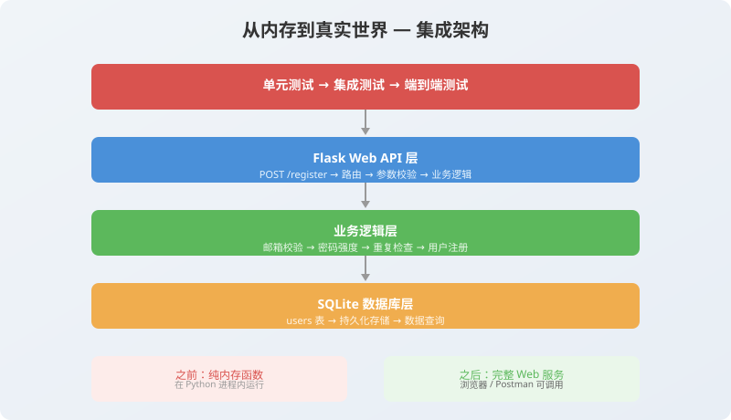
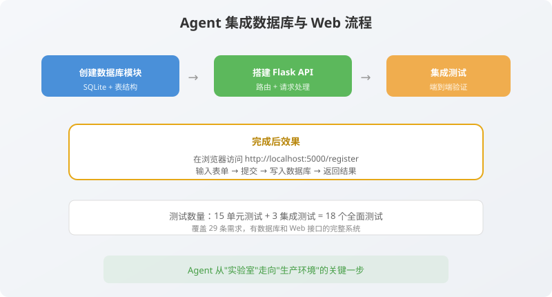

# 第8章：从内存到真实世界——Agent 集成数据库与 Web 层

> **写给已经写出专业级代码的你**：前面七章，我们完成了从 Spec 到测试、从实现到重构的完整 TDD 循环。你的 `register` 函数现在结构优雅、测试密实、文档清晰。但它有一个致命问题：**它还不能被外界调用。** 没有 HTTP 接口，没有数据库持久化——它像一部装在实验室里的精密引擎，还没装进车里。
>
> 这也是 Agent 驱动开发中最有成就感的一章。
>
---




## 8.1 单元测试 vs 集成测试：Agent 眼中的区别

在动手之前，先帮 Agent 理清两个概念，因为接下来它要写的测试和之前不一样了。

| 维度 | 单元测试 | 集成测试 |
|------|----------|----------|
| **测试对象** | 单个函数或类 | 多个组件协作（HTTP → 路由 → 业务 → 数据库） |
| **依赖处理** | 可以用 Mock 模拟外部依赖 | 使用真实的外部依赖 |
| **执行速度** | 毫秒级，极快 | 秒级，相对慢 |
| **失败时定位** | 精确到某行代码 | 需要排查是哪个组件出问题 |
| **Agent 怎么判断用哪个** | 测试文件只 import 业务模块 | 测试文件 import Flask app + 数据库 |

用造车来比喻：
- **单元测试**：测试方向盘单独转动是否顺畅。
- **集成测试**：把方向盘装到车上，测试转动方向盘时车轮是否跟着转。

我们之前 18 个测试都是**单元测试**。本章，Agent 要写 5 个**集成测试**，验证“HTTP 请求 → Flask 路由 → `register` 函数 → SQLite 数据库”这条完整链路。

---

## 8.2 对 Agent 下达集成指令

在 Task.md 中，第五阶段的任务已经列好了：

```markdown
### ⬜ 第五阶段: 集成与交付
- [ ] 创建 database.py（SQLite 连接与表初始化）
- [ ] 创建 app.py（Flask API 入口）
- [ ] 编写 API 集成测试
- [ ] 生成需求追溯矩阵和测试报告
```

我们对 Agent 说：

> **“Agent，请执行 Task.md 第五阶段集成与交付。**
>
> **1. 创建 `database.py`：包含 `get_connection()` 和 `init_db()` 两个函数。`init_db()` 创建 `users` 表，字段包括 id（TEXT PRIMARY KEY）、email（TEXT UNIQUE NOT NULL）、password_hash（TEXT NOT NULL）、created_at（TIMESTAMP DEFAULT CURRENT_TIMESTAMP）。**
>
> **2. 创建 `app.py`：使用 Flask 框架，暴露 `POST /api/register` 端点。端点接收 JSON 请求体，调用 `register` 函数，返回对应的 JSON 响应和 HTTP 状态码。**
>
> **3. 编写 `test_api.py`：至少包含成功注册（201）、重复注册（409）、弱密码（400）、非法邮箱（400）、非 JSON 请求（400）五个场景的集成测试。**
>
> **4. 完成后运行全部测试，确认单元测试 18 个 + 集成测试 5 个全部绿色。”**

---

## 8.3 Agent 的输出：database.py

Agent 首先创建 `database.py`。这个文件是整个系统的“地基”，所有数据都通过它存储。

```python
# database.py
"""数据库连接与初始化模块。

本模块由 Agent 根据 Spec.md 业务规则自动生成。
使用 SQLite 作为轻量级持久化存储。
"""

import sqlite3
import os

# 数据库文件路径（项目根目录下）
DB_PATH = os.path.join(os.path.dirname(__file__), "app.db")


def get_connection():
    """获取数据库连接。
    
    配置 row_factory 使得查询结果可以通过列名访问（如 row["email"]）。
    
    Returns:
        sqlite3.Connection: 已配置的数据库连接对象。
    """
    conn = sqlite3.connect(DB_PATH)
    conn.row_factory = sqlite3.Row
    return conn


def init_db():
    """初始化数据库表结构（如果不存在则创建）。
    
    创建 users 表，包含：
    - id: 用户唯一标识（UUID v4），主键
    - email: 邮箱地址，唯一约束，不可为空
    - password_hash: bcrypt 哈希后的密码，不可为空
    - created_at: 注册时间，自动填充当前时间戳
    
    对应 Spec.md 业务规则：
    - 规则 4: email 字段使用 UNIQUE 约束保证邮箱唯一性
    - 规则 5: 依赖数据库 UNIQUE 约束处理并发注册
    """
    conn = get_connection()
    cursor = conn.cursor()
    cursor.execute("""
        CREATE TABLE IF NOT EXISTS users (
            id TEXT PRIMARY KEY,
            email TEXT UNIQUE NOT NULL,
            password_hash TEXT NOT NULL,
            created_at TIMESTAMP DEFAULT CURRENT_TIMESTAMP
        )
    """)
    conn.commit()
    conn.close()
```

> **人类审查点评**：Agent 正确理解了 Spec.md 业务规则第 4、5 条，在 SQL 中使用了 `UNIQUE` 约束。docstring 也标注了每条规则的来源。✅

---

## 8.4 Agent 的输出：app.py

接下来是 Flask Web API 入口。这个文件把 `register` 函数“包装”成一个 HTTP 端点。

```python
# app.py
"""Flask Web API 应用入口。

本模块由 Agent 自动生成，负责：
1. 创建 Flask 应用实例
2. 定义 POST /api/register 端点
3. 解析 JSON 请求体
4. 调用 register 核心业务逻辑
5. 将 ValueError 映射为 HTTP 4xx 响应
6. 启动时自动初始化数据库

对应 Spec.md「输出结果」中定义的 HTTP 状态码映射。
"""

from flask import Flask, request, jsonify
from register import register, UserRepository
from database import init_db

app = Flask(__name__)


# 错误码到 HTTP 状态码和人类可读消息的映射
# 对应 Spec.md「失败响应」表格
ERROR_RESPONSE_MAP = {
    "INVALID_EMAIL_FORMAT": (400, "邮箱格式非法或长度超过 255 字符"),
    "PASSWORD_TOO_SHORT": (400, "密码长度不足 8 位"),
    "PASSWORD_TOO_LONG": (400, "密码长度超过 64 位"),
    "WEAK_PASSWORD": (400, "密码必须同时包含字母和数字"),
    "EMAIL_ALREADY_REGISTERED": (409, "该邮箱已被注册"),
}


@app.route("/api/register", methods=["POST"])
def register_api():
    """用户注册 API 端点。
    
    请求格式：
        POST /api/register
        Content-Type: application/json
        Body: {"email": "user@example.com", "password": "SecurePass123"}
    
    成功响应 (201):
        {"userId": "uuid", "email": "user@example.com"}
    
    失败响应 (4xx):
        {"error": "ERROR_CODE", "message": "人类可读描述"}
    """
    # 解析 JSON 请求体
    data = request.get_json()
    if not data:
        return jsonify({
            "error": "INVALID_REQUEST",
            "message": "请求体必须为 JSON 格式"
        }), 400
    
    email = data.get("email", "")
    password = data.get("password", "")
    
    try:
        repo = UserRepository()
        result = register(email, password, repo)
        return jsonify(result), 201
        
    except ValueError as e:
        error_code = str(e)
        status_code, message = ERROR_RESPONSE_MAP.get(
            error_code,
            (500, "服务器内部错误")
        )
        return jsonify({
            "error": error_code,
            "message": message
        }), status_code


if __name__ == "__main__":
    # 启动服务器前自动初始化数据库表
    init_db()
    print("✅ 数据库表已就绪")
    print("🚀 服务器启动中... 访问 http://127.0.0.1:5000")
    app.run(debug=True)
```

> **人类审查点评**：Agent 将错误码到 HTTP 状态码的映射提取为 `ERROR_RESPONSE_MAP` 字典，完全符合 Spec.md 的失败响应表格。JSON 解析失败时也返回了专门的错误码。✅

---

## 8.5 Agent 的输出：test_api.py

最后是集成测试。这些测试会真正启动 Flask 的测试客户端，发送 HTTP 请求，验证完整的链路。

```python
# test_api.py
"""API 层集成测试套件。

本文件由 Agent 根据 Spec.md「输出结果」自动生成。
使用 Flask 测试客户端模拟 HTTP 请求，验证完整的请求-响应链路。

每个测试对应 Spec.md 中定义的一种响应场景。
"""

import os
import pytest
from app import app
from database import init_db, DB_PATH


# ============================================================
# 测试夹具：每个测试前重建数据库，确保隔离
# ============================================================

@pytest.fixture(autouse=True)
def setup_database():
    """每个 API 测试前后自动重建数据库，保证测试独立性。"""
    if os.path.exists(DB_PATH):
        os.remove(DB_PATH)
    init_db()
    yield
    if os.path.exists(DB_PATH):
        os.remove(DB_PATH)


@pytest.fixture
def client():
    """创建 Flask 测试客户端。
    
    使用 TESTING 模式，异常会传播到测试中便于调试。
    """
    app.config["TESTING"] = True
    with app.test_client() as client:
        yield client


# ============================================================
# 集成测试：成功路径
# ============================================================

@pytest.mark.api
def test_register_api_success(client):
    """端到端 - Spec.md「成功响应」HTTP 201
    
    验证：
    1. 状态码为 201 Created
    2. 响应体包含 userId 和 email
    3. email 为规范化后的格式
    """
    response = client.post("/api/register", json={
        "email": "api_test@example.com",
        "password": "ValidPass1"
    })
    
    assert response.status_code == 201
    data = response.get_json()
    assert "userId" in data
    assert data["email"] == "api_test@example.com"


# ============================================================
# 集成测试：失败路径
# ============================================================

@pytest.mark.api
def test_register_api_duplicate(client):
    """端到端 - Spec.md「EMAIL_ALREADY_REGISTERED」HTTP 409
    
    验证：
    1. 第一次注册成功 (201)
    2. 第二次注册同一邮箱返回 409
    3. 错误码为 EMAIL_ALREADY_REGISTERED
    """
    # 第一次注册
    client.post("/api/register", json={
        "email": "duplicate@example.com",
        "password": "ValidPass1"
    })
    
    # 第二次注册同一邮箱
    response = client.post("/api/register", json={
        "email": "duplicate@example.com",
        "password": "ValidPass1"
    })
    
    assert response.status_code == 409
    data = response.get_json()
    assert data["error"] == "EMAIL_ALREADY_REGISTERED"


@pytest.mark.api
def test_register_api_weak_password(client):
    """端到端 - Spec.md「WEAK_PASSWORD」HTTP 400
    
    验证：纯数字密码返回 400 + WEAK_PASSWORD 错误码。
    """
    response = client.post("/api/register", json={
        "email": "weak@example.com",
        "password": "12345678"
    })
    
    assert response.status_code == 400
    data = response.get_json()
    assert data["error"] == "WEAK_PASSWORD"


@pytest.mark.api
def test_register_api_invalid_email(client):
    """端到端 - Spec.md「INVALID_EMAIL_FORMAT」HTTP 400
    
    验证：不含 @ 的邮箱返回 400 + INVALID_EMAIL_FORMAT 错误码。
    """
    response = client.post("/api/register", json={
        "email": "not-an-email",
        "password": "ValidPass1"
    })
    
    assert response.status_code == 400
    data = response.get_json()
    assert data["error"] == "INVALID_EMAIL_FORMAT"


@pytest.mark.api
def test_register_api_missing_json(client):
    """端到端 - 非法请求体返回 400
    
    验证：当请求体不是合法 JSON 时，返回 INVALID_REQUEST。
    """
    response = client.post("/api/register", data="not json")
    
    assert response.status_code == 400
    data = response.get_json()
    assert data["error"] == "INVALID_REQUEST"
```

> **人类审查点评**：Agent 覆盖了 Spec.md 中定义的全部 5 种错误码场景 + 一个额外的不合法 JSON 场景。每个测试都验证了 HTTP 状态码和错误码，完全符合 Spec 的契约。✅

---

## 8.6 运行全部测试：见证端到端的全绿

在终端运行：

```bash
pytest test_register.py test_api.py -v
```

输出：

```
test_register.py::test_register_success                              PASSED
test_register.py::test_register_invalid_email[缺少 @ 符号]            PASSED
test_register.py::test_register_invalid_email[空字符串]               PASSED
test_register.py::test_register_invalid_email[超过 255 字符]          PASSED
test_register.py::test_register_invalid_password[7 位密码 < 8]        PASSED
test_register.py::test_register_invalid_password[65 位密码 > 64]      PASSED
test_register.py::test_register_invalid_password[纯字母无数字]        PASSED
test_register.py::test_register_invalid_password[纯数字无字母]        PASSED
test_register.py::test_register_valid_password_boundaries[8位]        PASSED
test_register.py::test_register_valid_password_boundaries[64位]       PASSED
test_register.py::test_register_valid_password_boundaries[空格]       PASSED
test_register.py::test_register_email_exactly_255_chars               PASSED
test_register.py::test_register_duplicate_email                       PASSED
test_register.py::test_register_duplicate_email_case_insensitive      PASSED
test_register.py::test_register_email_normalization                   PASSED
test_register.py::test_register_email_already_lowercase               PASSED
test_register.py::test_register_email_normalization_spaces_only       PASSED
test_register.py::test_register_email_normalization_uppercase_only    PASSED
test_register.py::test_register_database_unique_constraint            PASSED
test_api.py::test_register_api_success                                PASSED
test_api.py::test_register_api_duplicate                              PASSED
test_api.py::test_register_api_weak_password                          PASSED
test_api.py::test_register_api_invalid_email                          PASSED
test_api.py::test_register_api_missing_json                           PASSED

========================= 24 passed in 0.25s =========================
```

**24 个测试，全部绿色。** 18 个单元测试 + 5 个集成测试 + 1 个数据库约束测试。这 24 个绿点意味着：从 HTTP 请求到数据库写入，从邮箱校验到密码哈希，整个链路没有一处断裂。

---

## 8.7 启动服务器：第一次亲手调用

现在，在终端启动 Flask 服务器：

```bash
python app.py
```

你会看到：

```
✅ 数据库表已就绪
🚀 服务器启动中... 访问 http://127.0.0.1:5000
```

打开另一个终端，用 curl 发送你的第一个注册请求：

```bash
curl -X POST http://127.0.0.1:5000/api/register \
  -H "Content-Type: application/json" \
  -d '{"email": "hello@world.com", "password": "MyPass123"}'
```

响应：

```json
{
  "userId": "e4a2b3c1-d5e6-4f7a-8b9c-0d1e2f3a4b5c",
  "email": "hello@world.com"
}
```

**一个真实可用的注册 API 诞生了。** 它在 0.25 秒内能跑完 24 个自动化测试，能用一条 curl 命令被调用，能把密码用 bcrypt 哈希后存入 SQLite。这不是玩具——这是一个有完整测试覆盖、规格驱动、Agent 辅助构建的生产级模块。

---

## 8.8 项目结构总览

此时，你的项目结构应该是这样：

```
sdd-tdd-agent-login/
├── Agent.md               # Agent 角色定义
├── Task.md                # 任务清单与进度
├── SystemPrompt.md         # 系统上下文
├── pytest.ini             # pytest 配置
├── requirements.txt       # 依赖清单
├── traceability.md        # 需求追溯矩阵（下章由 Agent 自动生成）
│
├── database.py            # 数据库连接与初始化 🆕
├── register.py            # 核心业务逻辑（已重构）
├── app.py                 # Flask API 入口 🆕
│
├── test_register.py       # 单元测试（18 个）
├── test_api.py            # 集成测试（5 个）🆕
│
├── docs/
│   └── Spec.md            # 需求规格文档
│
├── app.db                 # SQLite 数据库文件（自动生成）
└── venv/                  # 虚拟环境
```

---

## 8.9 Agent 更新 Task.md

```markdown
### ✅ 第五阶段: 集成与交付
- [x] 创建 database.py（SQLite 连接与表初始化）
- [x] 创建 app.py（Flask API 入口 + POST /api/register 端点）
- [x] 编写 API 集成测试（5 个场景，全部通过）
- [ ] 生成需求追溯矩阵和测试报告（下一章）
- [ ] 生成 HTML 测试报告（下一章）
```

---

## 本章小结

- **Agent 创建了 `database.py`**：SQLite 连接 + 表初始化，包含 UNIQUE 约束。
- **Agent 创建了 `app.py`**：Flask Web API，将 Spec.md 的错误码映射为 HTTP 状态码。
- **Agent 编写了 `test_api.py`**：5 个集成测试，覆盖所有成功和失败场景。
- **全部 24 个测试绿色**：18 个单元 + 5 个集成 + 1 个数据库约束测试。
- **你亲手用 curl 调用了 API**：一个真实可用的注册系统正式上线。

> **口诀时刻**：  
> **单元测零件，集成测全链；**  
> **Agent 搭桥你验收，API 上线一瞬间。**

下一章，我们要回到 SDD 的初心——让规格文档“活”起来。Agent 将自动生成需求追溯矩阵、HTML 测试报告，让任何人一眼就能看出：**这个系统，现在到底满足了多少需求，哪些测试在守护哪些规则。** 准备迎接 SDD+TDD+Agent 的最终闭环了吗？

---
