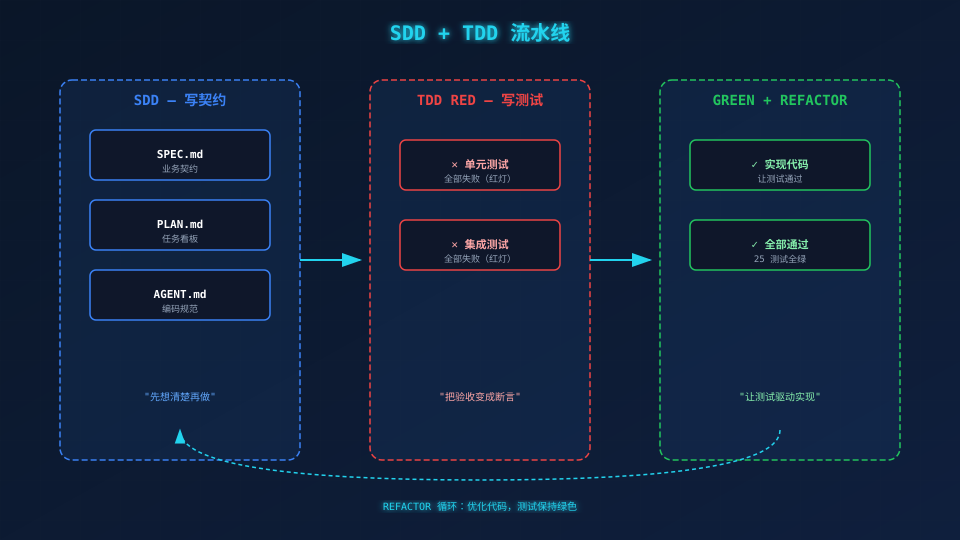
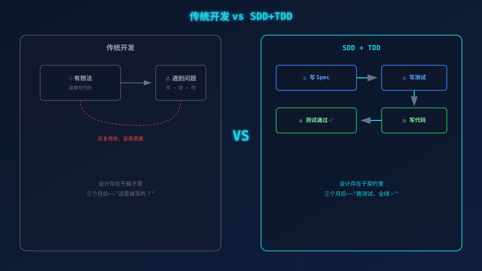

# 从"会写代码"到"会设计代码"——SDD+TDD 框架

> **场景带入 → 发现问题 → 方案迭代 → 原理拆解 → 效果对比 → 情绪升华**

---

## 一、你肯定遇到过的问题

你花了一天写了一个登录接口，测试时发现：

1. 密码忘了加密，明文存进去了
2. 加密了，但密码哈希也返回给前端了
3. 修好了，然后发现同事也写了一个登录接口，返回格式不一样

你改了三遍，最后勉强能跑。然后产品经理说"加一个字段"——你又改了一遍，发现三个测试用例全挂了。

**问题出在哪？** 出在"先写代码再说"的惯性上。

## 二、最直接的做法：先写代码

"先跑起来再说"——这是大多数人的第一反应。

问题是：设计只存在于你的脑子里，代码是它唯一的表达。别人看不懂，三个月后的你自己也看不懂。**一个改动的影响范围，只能靠读代码猜。**

## 三、所以换一种思路：先写契约，再写测试，最后写代码

这就是 **SDD + TDD**。整个项目分成 5 个迭代，每个迭代只做 2-3 个文件：

```
Iter 0: 写 SPEC / PLAN / AGENT / 脚手架（搭好框架，不写代码）
Iter 1: 写 utils/errors.js + utils/password.js + utils/jwt.js（工具函数）
Iter 2: 写 models/user.js + scripts/seed.js（数据模型 + 种子）
Iter 3: 写 services/authService.js（业务逻辑）
Iter 4: 写 controllers/ + routes/ + middleware/ + app.js（HTTP 接口）
Iter 5: 完整验证，全部通过
```

**每个 Iter 的执行顺序相同：**



```
① 读 SPEC 确定范围 → ② 先写测试（RED）→ ③ 再写代码（GREEN）→ ④ 跑测试，全绿 ✅
```

## 四、本质：把大问题拆成小问题

一次写 12 个文件，你很难保证不出错。一次写 1-3 个文件，每个文件都有对应的测试守护——**改坏了立刻知道，不需要等全部写完。**

本项目的最终目标：

```bash
$ npm test
Test Suites: 6 passed, 6 total
Tests:       30 passed, 30 total
```

## 五、有迭代规划和没有的差距

| 场景 | 没有迭代规划 | 有迭代规划 |
|------|-------------|-----------|



| 写代码 | 一次性写 12 个文件，不知道从哪开始 | 每次只写 1-3 个文件，做完一个 Iter 再做下一个 |
| 测试 | 写完再测，发现 11 个错误 | 每个 Iter 先写测试，随时发现问题 |
| 改代码 | 改了 1 处，不知道影响了哪 3 处 | 跑测试，30 条在 2 秒内告诉你 |

## 六、本项目的迭代路径

```
Iter 0: SPEC / PLAN / AGENT → 先想清楚
Iter 1: 工具函数 → 独立的 3 个文件，13 条测试
Iter 2: 数据模型 → 用户模型 + 种子数据
Iter 3: 服务层 → 登录业务逻辑
Iter 4: HTTP 接口 → 路由 + 控制器 + 错误处理
Iter 5: 验证 → 30 条测试全部通过 ✅
```

下一篇：**写 SPEC——把需求变成契约。**

---

*下一篇：01-SPEC.md——把需求写成契约。*