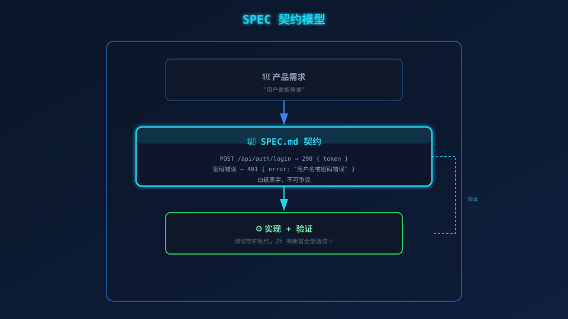
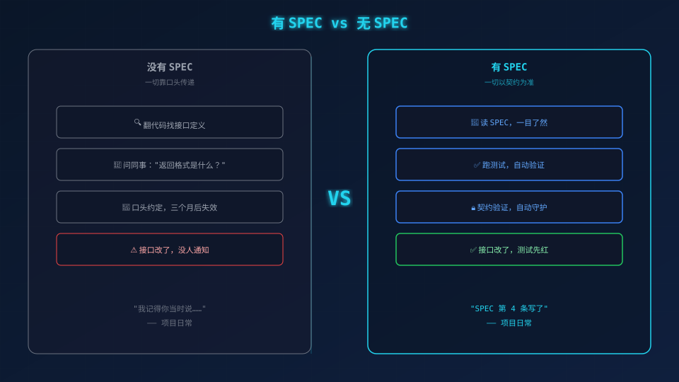

# 把需求写成契约——SPEC.md

> **你的代码没炸，只是因为你还没上线。**

---

## 一、「你翻一下代码，在第 47 行」

你问同事：「登录接口返回什么格式？」

他头也不抬：「嗯……我翻一下代码。哦，在第 47 行，返回 `{ token }`。」

你信了。写进前端，联调通过，上线。

三天后线上告警：**全部登录失败**。

你翻 Git 记录——有人改了后端，返回变成 `{ data: { token } }`。没人通知你，没有文档，没有邮件，什么都没有。你盯着 Slack 上三天前那句「在第 47 行」咬牙切齿。

**这不叫沟通问题。这叫你们之间没有一份具备法律效力的契约。**

---

## 二、你天真地写了 README，然后呢？

被坑过一次之后，你在 README 里加了一段：

```markdown
## API
- POST /api/auth/login → 返回 token
```

写完觉得踏实了。文档都有了，再出事不怪我了吧？

一周后你又上线了。又炸了。

你跑去一看——代码改了，README 还挂着那条优雅的 Markdown，像一块墓碑。

**Readme 是「描述」，不是「契约」。** 描述是写给路过的人看的，过期了就过期了，没人会为它负责。它像一张贴在墙上的便利贴——方便，但谁都可以无视它。

你要的是一份**双方签字画押的合同**，甲方违约了，乙方能拿着合同去拍桌子。

---

## 三、真正的合同叫 SPEC

所以你需要的不是 `README.md`，而是 `SPEC.md`。

SPEC 不是「记录」，它是**合同**。白纸黑字，写清楚每一种情况。不仅是「正常情况」，更重要的是那些**让你半夜起来修 Bug 的边界情况**。

打开 `user-login/SPEC.md`，最核心的是**接口规范**：

```
正常登录   → 200 { "token": "..." }
密码错误   → 401 { "error": "用户名或密码错误" }
用户不存在 → 401 { "error": "用户名或密码错误" }（和密码错误一样！不告诉你哪个错了！）
参数缺失   → 400 { "error": "用户名和密码不能为空" }
```

看到「用户不存在」和「密码错误」返回同一个错误信息了吗？这**不是笔误**——这是安全设计。你告诉攻击者「用户不存在」，等于给了他一本花名册。SPEC 把这种细节写死，防止任何人「拍脑袋改一下」。

SPEC 还定义了项目的 **5 个迭代**，每个迭代只实现一部分，步步为营：

```
Iter 1: 工具函数（errors + password + jwt）
Iter 2: 数据模型 + 种子
Iter 3: 服务层
Iter 4: HTTP 接口
Iter 5: 完整验证
```

---

## 四、SPEC 是可执行的文档——测试就是执法者

普通的文档写完了就躺在那，等着腐烂。SPEC 不一样。

**SPEC 里每一条约定，最终都会变成一条测试用例。**

```javascript
// SPEC 说：用户不存在返回 401
it('用户不存在应返回 401', async () => {
  const res = await request(app).post('/api/auth/login')
    .send({ username: 'ghost', password: 'x' });
  expect(res.status).toBe(401);
});
```

现在这条 401 不再是一个美好的愿望。**它是一条带有强制力的法律条文。**



**SPEC 是合约，测试是执法者。**

- 只有合约没有执法者 → 文档迟早发霉
- 只有测试没有合约 → 测试写了什么全靠猜
- **合约 + 执法者** → 代码上线前就自己把自己审判了

每次 CI 跑起来，这些测试就像警察一样巡逻。谁改坏了接口？测试直接亮红灯。你不需要去问「谁改了什么」，CI 告诉你。

---

## 五、有 SPEC 和没 SPEC 的差距，不是一个 README 的距离



| 场景 | 没 SPEC（靠脸靠嘴） | 有 SPEC（靠契约靠代码） |
|------|-------------------|----------------------|
| 新同事加入 | 翻代码 + 问人 + 被白眼 | 读 SPEC，10 分钟搞懂 |
| 接口变更 | 口头通知 + 运气好知道 / 运气不好上线炸 | 改 SPEC → 改测试 → 改代码，链条完整 |
| 验收测试 | 打开 Postman 点三遍「发送」，假装测完了 | 30 条测试一键跑完，绿了就过 |
| 线上排查 | 翻日志猜字段 | 翻 SPEC 对契约，一秒定位偏差 |

没 SPEC 的时候，你的知识库长在每个人的脑子里。人走了，知识也走了。有 SPEC 的时候，知识长在代码仓库里，谁也带不走。

---

## 六、合同签好了，然后呢？

OK，合同有了，执法者（测试）也安排上了。

但问题来了——**5 个迭代，先做哪个？** 你不是一个人在战斗，你和你的队友不能各做各的，代码合到一起才发现一个做了 Iter 2，另一个也在做 Iter 2，Iter 1 还没人碰。

这就是下一篇文章要做的事。

> 🗺️ **下一篇：[02-PLAN.md——把任务排成地图。](PLAN.md)**
>
> *先把路画清楚再开车，不然你以为自己在竞速，其实是在碰碰车场地里踩油门。*

---

*下一篇：02-PLAN.md——把任务排成地图。*