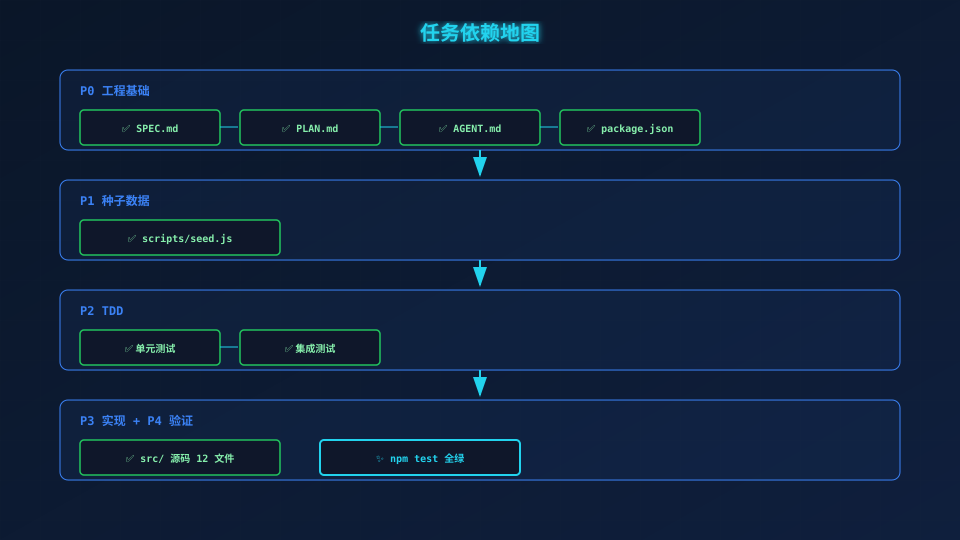
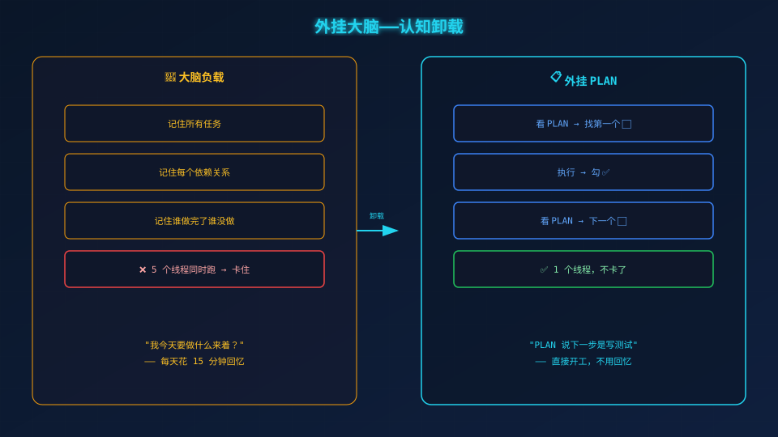

# 把任务排成地图——PLAN.md

> **场景带入 → 发现问题 → 方案迭代 → 原理拆解 → 效果对比 → 情绪升华**

---

## 一、你肯定遇到过的问题

你打开项目，准备写代码。

"好，先写登录接口……等等，测试写了吗？环境搭了吗？模型建了吗？"

**你在脑子里转了三圈，然后决定先刷五分钟手机。**

这不是执行力问题——你的大脑不适合同时调度 15 个任务。

## 二、最直接的做法：列个清单

你写下：

```
1. 写登录接口
2. 写测试
3. 搭环境
```

然后发现：写测试时发现环境没搭好，卡住了。搭环境时发现没有 package.json，又卡住了。**你列的是清单，不是计划。**



## 三、所以换一种思路：写 PLAN

PLAN 是**任务地图**，告诉你三件事：现在在哪、下一步去哪、哪些路是通的。

打开 `user-login/PLAN.md`，项目被拆成 **6 个迭代**：

```
Iter 0: 工程基础（SPEC / PLAN / AGENT / 脚手架）
  ↓
Iter 1: 工具函数（3 个文件，13 条测试）
  ↓
Iter 2: 数据模型（2 个文件，5 条测试）
  ↓
Iter 3: 服务层（1 个文件，3 条测试）
  ↓
Iter 4: HTTP 接口（5 个文件，8 条测试）
  ↓
Iter 5: 完整验证（30 条测试全部通过）
```

每个 Iter 内部还有更细的步骤：

```
Iter 1 的步骤：
1.1 写 errors.test.js → 写 errors.js → 绿了 ✅
1.2 写 password.test.js → 写 password.js → 绿了 ✅
1.3 写 jwt.test.js → 写 jwt.js → 绿了 ✅
```

## 四、本质：外挂大脑

没有 PLAN，你的大脑在做 5 件事：记住所有任务、记住依赖关系、记住谁做完了、记住切换上下文、同时写代码。**5 个线程同时跑，不卡才怪。**

有 PLAN，你的大脑只需要做 1 件事：**看 PLAN → 找第一个 ⬜ → 执行 → 勾 ✅**



## 五、有 PLAN 和没 PLAN 的差距

| 场景 | 没 PLAN | 有 PLAN |
|------|---------|---------|
| 早上开始 | 花 15 分钟回忆"昨天做到哪了" | 打开 PLAN，⬜ 就是今天的目标 |
| 被人打断 | 回来不知道从哪继续 | 上一个 ✅ 就是断点 |
| 任务卡住 | 不知道依赖还没完成 | 依赖关系写在 PLAN 里 |

## 六、下一迭代

接下来写**编码规范——AGENT.md**。

---

*下一篇：03-AGENT.md——把规范写成门禁。*