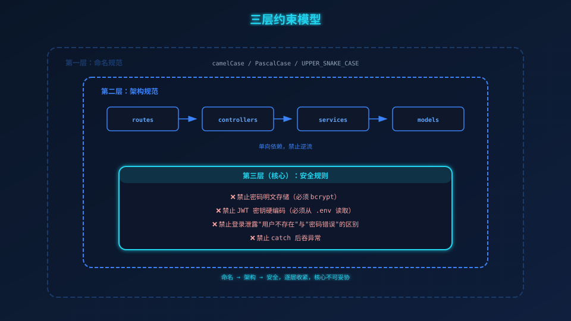
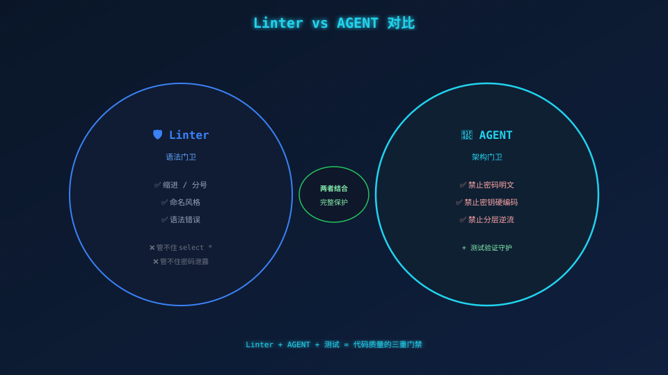

# 把规范写成门禁——AGENT.md

> **场景带入 → 发现问题 → 方案迭代 → 原理拆解 → 效果对比 → 情绪升华**

---

## 一、你肯定遇到过的问题

你在 review 一段代码：

```javascript
const user = await db.query("select * from users where id = " + id);
ctx.body = { passwordHash: user.passwordHash };
```

能通过 linter（没有语法错误），但你能接受吗？**SQL 注入 + 密码泄露，两个安全问题。**

**Linter 是语法门卫，不是架构门卫。** 你需要一份"人肉可读的 linter 配置"。



## 二、最直接的做法：装个 ESLint

ESLint 管住了缩进和分号，但管不住 `select *`，管不住密码泄露。**Linter 管语法，不管架构和安全。**

## 三、所以换一种思路：写 AGENT

打开 `user-login/AGENT.md`，核心是**禁止事项**表：

| 禁止 | 原因 |
|------|------|
| 密码明文存储 | 必须 bcrypt |
| JWT 密钥硬编码 | 必须从 .env 读取 |
| catch 后吞异常 | 必须 throw 或转 AppError |
| 登录泄露用户是否存在 | 防枚举攻击 |

**每一条 AGENT 的禁止项，最终都有一条测试在守卫：**

```javascript
// AGENT 说：登录不能泄露用户是否存在
// tests/integration/auth.test.js
it('错误消息与密码错误完全一致（防枚举）', async () => {
  const [wrongPass, notFound] = await Promise.all([
    post('/api/auth/login', { username: 'admin', password: 'wrong' }),
    post('/api/auth/login', { username: 'ghost', password: 'x' }),
  ]);
  expect(wrongPass.body).toEqual(notFound.body);  // 完全一致
});
```

## 四、本质：团队的默认行为

AGENT 只写"禁止项"和"必须项"，不写"建议项"。

```
✅ 禁止：密码明文存储（这是一个停止命令）
❌ 建议：可以考虑用更安全的密码存储方式（没人会执行的模糊建议）
```

## 五、有 AGENT 和没 AGENT 的差距

| 场景 | 没 AGENT | 有 AGENT |
|------|---------|---------|



| 新成员 | 看完代码猜规范 | 读完 AGENT 再写代码 |
| 代码审查 | 凭 reviewer 心情 | 对照 AGENT 逐条检查 |
| 安全漏洞 | 上线后才发现 | AGENT 提前拦截 |

## 六、下一迭代

规范写好了，接下来**搭脚手架——package.json + .env + .gitignore。**

---

*下一篇：04-脚手架——搭好工程底座。*