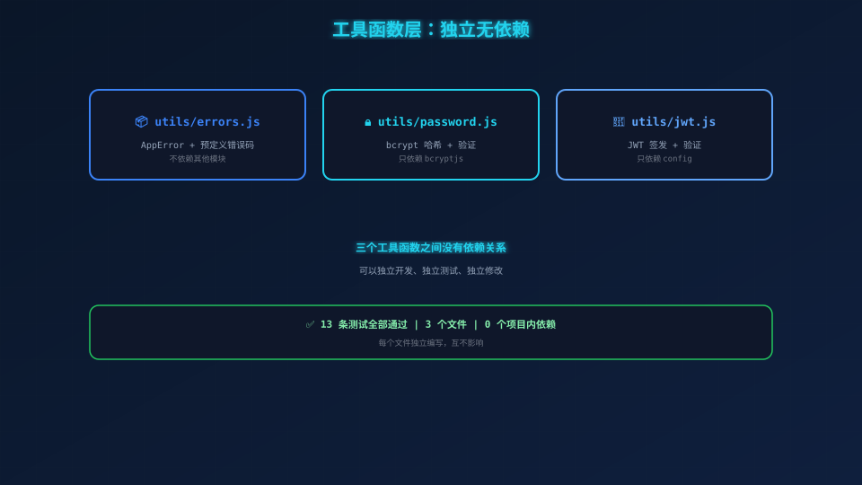
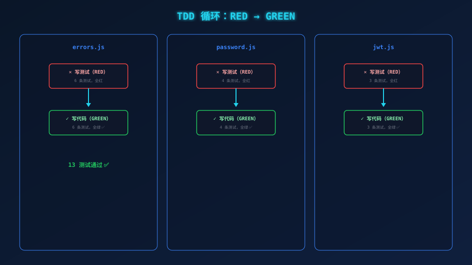

# Iter 1：工具函数层——先写测试，再写代码

> **场景带入 → 发现问题 → 方案迭代 → 原理拆解 → 效果对比 → 情绪升华**

---

> 这是**第一个真正的开发迭代**。前 4 篇文章我们在"搭框架"，现在开始写代码。
> 
> 按照 PLAN，Iter 1 只做 3 个文件，每个文件先写测试，再写实现。**一次只做一件事，做完再测，测完再做下一件。**

---

## 一、你肯定遇到过这个问题

你写了一个工具函数，觉得"这么简单，不用测了吧"。

上线后才发现：

- `bcrypt.genSalt` 忘了传 rounds，用了默认值——**性能慢得离谱**
- `jwt.sign` 忘了传 `expiresIn`——**Token 永不过期，安全漏洞**
- `new Error('wrong')` 和 `new Error('WRONG')`——**错误消息不统一，前端没法处理**

**工具函数的问题，往往不是"能不能跑"，而是"边界条件对不对、参数传没传全"。**

而这恰恰是**肉眼 review 最容易漏掉的地方**——你写的时候觉得"肯定没问题"，实际上可能漏了关键参数。



## 二、先看测试：为什么从 errors 开始？

三个工具函数 `errors`、`password`、`jwt` 之间没有依赖关系，先写哪个都行。但我们从 `errors` 开始，因为**它是其他模块的基础**——`authService` 里到处都在 `throw Errors.INVALID_CREDENTIALS`。

### 写测试（RED）

打开 `tests/unit/errors.test.js`，我们要验证两件事：

1. `AppError` 这个类能正确携带错误信息和状态码
2. 预定义的错误常量（如 `INVALID_CREDENTIALS`）有正确的默认值

前者保证"自定义错误的格式统一"，后者保证"你永远不会写错错误码"。

```javascript
it('AppError 应携带 message 和 statusCode', () => {
  const err = new AppError('自定义错误', 400);
  expect(err.message).toBe('自定义错误');
  expect(err.statusCode).toBe(400);
});

it('INVALID_CREDENTIALS: 401 用户名或密码错误', () => {
  expect(Errors.INVALID_CREDENTIALS.statusCode).toBe(401);
  expect(Errors.INVALID_CREDENTIALS.message).toBe('用户名或密码错误');
});
```

**跑一下：** `npx jest tests/unit/errors.test.js` → 报错，`Cannot find module`。正常，因为 `errors.js` 还不存在。**这就是 RED——测试先红，再让它变绿。**

### 写实现（GREEN）

```javascript
// src/utils/errors.js
class AppError extends Error {
  constructor(message, statusCode = 500) {
    super(message);
    this.name = 'AppError';
    this.statusCode = statusCode;
  }
}
const Errors = {
  INVALID_CREDENTIALS: new AppError('用户名或密码错误', 401),
  MISSING_PARAMS: (msg) => new AppError(msg, 400),
  INTERNAL: new AppError('服务器内部错误', 500),
};
```

注意第 2 行的 `statusCode = 500`——**默认值是 500**，如果你忘了传，它不会静默地变成 undefined。

**再跑一次：** `npx jest tests/unit/errors.test.js` → 6 条全绿 ✅

## 三、再来：password 测试——边界条件最密集的地方

密码工具是**最容易出安全问题的地方**。不设边界的 `hashPassword` 可能在收到 `undefined` 时直接崩溃。

### 写测试（RED）

```javascript
// tests/unit/password.test.js
it('密码少于 6 位时应抛出错误', async () => {
  await expect(hashPassword('12')).rejects.toThrow('密码长度不能少于 6 位');
});

it('密码匹配时应返回 true', async () => {
  bcrypt.compare.mockResolvedValue(true);
  const result = await verifyPassword('mypassword', 'hashed-value');
  expect(result).toBe(true);
});
```

注意：我们用了 `jest.mock('bcryptjs')`。为什么？因为真的 bcrypt 哈希要**几十毫秒**，而 mock 版本**1 微秒就返回了**。你的测试不应该因为加密速度而变慢。

### 写实现（GREEN）

```javascript
// src/utils/password.js
async function hashPassword(plainPassword) {
  if (!plainPassword || plainPassword.length < 6) {
    throw new Error('密码长度不能少于 6 位');
  }
  const salt = await bcrypt.genSalt(10);
  return bcrypt.hash(plainPassword, salt);
}
```

第 2 行的边界检查是关键——**空字符串、undefined、少于 6 位，全部拒绝。** 没有这条检查，`hashPassword('')` 会生成一个空密码的哈希，攻击者可以用空字符串登录。

**跑测试：** `npx jest tests/unit/password.test.js` → 4 条全绿 ✅

## 四、最后：JWT 测试——payload 格式是前后端约定

JWT 的作用不仅是"生成一个 token"，它还定义了**payload 里有什么字段**。前端和移动端依赖 payload 里的 `user_id` 来识别用户。

### 写测试（RED）

```javascript
// tests/unit/jwt.test.js
it('签发 token 应使用 user_id（非标准 sub）', () => {
  jwt.sign.mockReturnValue('mock-token');
  const token = signToken(1);
  expect(jwt.sign).toHaveBeenCalledWith(
    { user_id: 1 },   // 注意是 user_id，不是 sub！
    config.jwt.secret,
    { expiresIn: 86400 }  // 24 小时
  );
});
```

`expiresIn: 86400` 对应 24 小时，这是 SPEC 里写死的。如果哪天有人把 `config.jwt.expiresIn` 改成了 0（永不过期），这条测试会立刻报错。

### 写实现（GREEN）

```javascript
// src/utils/jwt.js
function signToken(userId) {
  return jwt.sign({ user_id: userId }, config.jwt.secret, { expiresIn: config.jwt.expiresIn });
}
function verifyToken(token) {
  return jwt.verify(token, config.jwt.secret);
}
```

**跑测试：** `npx jest tests/unit/jwt.test.js` → 3 条全绿 ✅

## 五、Iter 1 回顾

```bash
$ npx jest tests/unit/
Test Suites: 3 passed, 3 total
Tests:       13 passed, 13 total
```

**3 个文件，13 条测试，全部通过。** 每个文件都走了一遍"先红后绿"的过程。



有趣的是：**第 1 次跑 always 红色的**（因为没有代码），**第 2 次跑就绿了**（因为代码 exactly 满足测试）。这种"从红到绿的爽感"，就是 TDD 的正反馈循环。

## 六、进入 Iter 2

下一步：**数据模型 + 种子数据。**

```
Tests: 13 passed, 13 total ✅
```

---

*下一篇：06-Iter 2——数据模型 + 种子数据。*