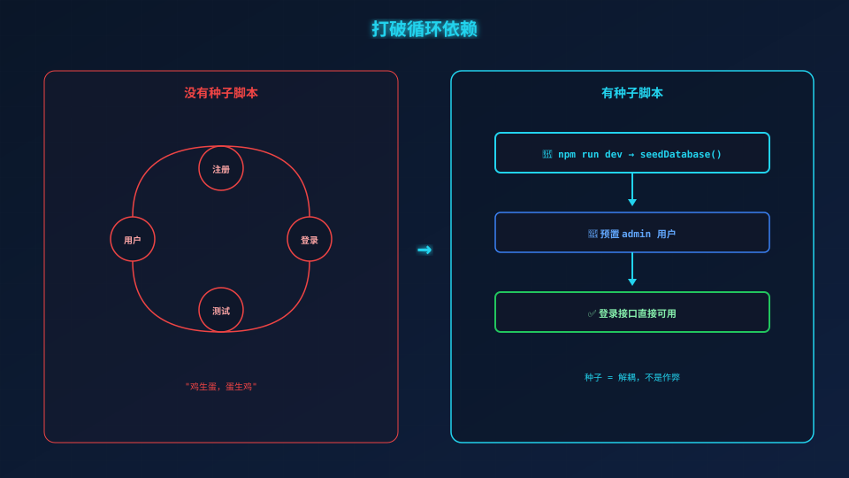
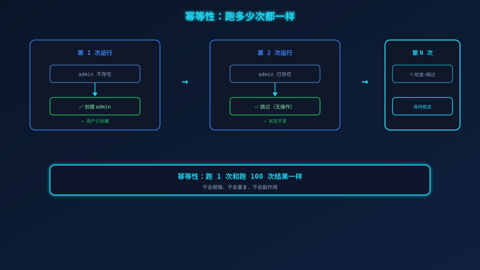

# Iter 2：数据模型 + 种子数据

> **场景带入 → 发现问题 → 方案迭代 → 原理拆解 → 效果对比 → 情绪升华**

---

> Iter 1 我们完成了工具函数。现在需要**数据模型**来存放用户，以及**种子数据**来预置测试用户。
>
> 只做 2 个文件：`models/user.js` + `scripts/seed.js`，外加 5 条测试。

---

## 一、你肯定遇到过的问题

你写好了登录接口，自信地打开终端：

```bash
curl -X POST http://localhost:3000/api/auth/login \
  -d '{"username":"admin","password":"admin123"}'
```

返回：`{ "error": "用户名或密码错误" }`

**你愣了两秒，然后想起来——哦，数据库里没有用户。**

这就是"鸡生蛋"问题：登录需要用户，创建用户需要注册接口，测试登录需要先有注册接口。**你被自己写的代码卡住了。**



## 二、先写模型测试：User 应该有哪几个方法？

打开 `tests/unit/userModel.test.js`，先定义 User 模型的行为。它应该支持：

- `create({ username, passwordHash })` → 创建用户，返回完整信息
- `findByUsername(name)` → 按用户名查找
- `findById(id)` → 按 ID 查找
- `clear()` → 清空所有用户（测试用）

### 写测试（RED）

```javascript
// tests/unit/userModel.test.js
beforeEach(() => { UserModel.clear(); });

it('应创建用户并返回完整信息', () => {
  const user = UserModel.create({ username: 'alice', passwordHash: 'hash123' });
  expect(user.id).toBe(1);
  expect(user.username).toBe('alice');
  expect(user.passwordHash).toBe('hash123');
  expect(user.createdAt).toBeInstanceOf(Date);
});

it('存在时返回用户，不存在时返回 undefined', () => {
  UserModel.create({ username: 'alice', passwordHash: 'hash123' });
  expect(UserModel.findByUsername('alice')).toBeDefined();
  expect(UserModel.findByUsername('nobody')).toBeUndefined();
});
```

注意 `beforeEach` 里的 `UserModel.clear()`——**每次测试前清空数据**，保证测试之间互不干扰。如果没有这条，测试 A 创建的用户会污染测试 B 的结果。

### 写实现（GREEN）

```javascript
// src/models/user.js
const users = new Map();
let nextId = 1;

const UserModel = {
  findByUsername(username) {
    return Array.from(users.values()).find((u) => u.username === username);
  },
  create({ username, passwordHash }) {
    const user = { id: nextId++, username, passwordHash, createdAt: new Date() };
    users.set(user.id, user);
    return user;
  },
  clear() { users.clear(); nextId = 1; },
};
```

**为什么用 Map 而不是数组？** `Map.get(id)` 是 O(1) 查找，数组的 `find` 是 O(n)。这里因为数据量小，用哪个都行，但 Map 更接近真实数据库的"主键索引"行为。

**跑测试：** `npx jest tests/unit/userModel.test.js` → 5 条全绿 ✅

## 三、写种子脚本：一次"预装"，省掉一万次注册

模型写好了，但数据库是空的——每次启动都要手动注册用户？**不现实。**

种子脚本（seed script）就是解决这个问题的：**启动时自动创建 admin 用户。**

```javascript
// scripts/seed.js
const SEED_USER = { username: 'admin', password: 'admin123' };

async function seedDatabase() {
  // 检查是否已存在——幂等性
  const existing = UserModel.findByUsername(SEED_USER.username);
  if (existing) return existing;  // 第二次运行不重复创建

  const passwordHash = await hashPassword(SEED_USER.password);
  const user = UserModel.create({
    username: SEED_USER.username,
    passwordHash,  // 🔒 存的是哈希，不是明文
  });
  return user;
}
```

两个关键设计：

**1. 幂等性：** `if (existing) return existing` 这一行保证你跑 1 次只创建 1 个用户，跑 100 次还是 1 个。不会报错，不会重复，不会炸。

**2. 密码走 bcrypt：** `hashPassword(SEED_USER.password)` 和正式登录走的是同一套加密逻辑。**不会出现"种子用户密码格式和正式用户不一致"的问题。**

种子脚本在 `src/index.js` 启动时自动调用：

```javascript
async function main() {
  await seedDatabase();  // 启动时预置 admin
  const app = createApp();
  app.listen(3000);
}
```

所以你 `npm run dev` 后，直接就能用 `admin / admin123` 登录。

## 四、Iter 2 的本质：打破循环依赖

```
没有种子脚本：注册 → 登录 → 需要用户 → 卡住了
有种子脚本：种子脚本 → 预置 admin → 登录直接可用 → 测试不用等注册
```

**种子数据不是"作弊"，是"解耦"。** 它让你可以独立开发、独立测试登录模块，而不必等到注册模块完成后才能开始。



## 五、验证

```bash
$ npx jest tests/unit/
Tests: 18 passed, 18 total ✅
```

## 六、进入 Iter 3

数据模型准备好了，接下来写**登录业务逻辑——服务层。**

```
Tests: 18 passed, 18 total ✅
```

---

*下一篇：07-Iter 3——服务层（authService）。*