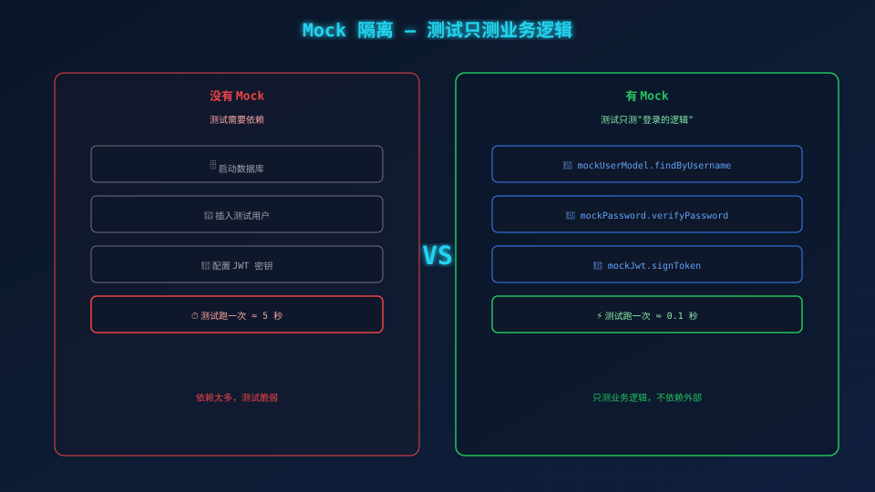
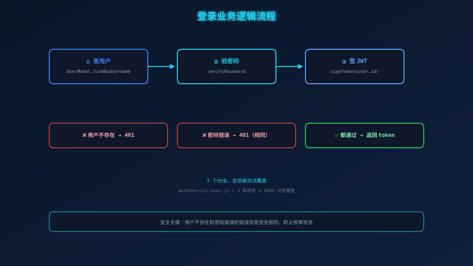

# Iter 3：服务层——你的登录逻辑正在裸奔

> **看标题先别走。我知道你在想什么：登录嘛，查用户→验密码→签 JWT，三行代码的事。**

---

## 一、三行代码？你的系统可能正在裸奔

我第一次把登录逻辑直接写在控制器里是这样的：

```javascript
async login(ctx) {
  const user = await db.query('SELECT * FROM users WHERE username = ?', [username]);
  if (!user) { ctx.status = 401; return; }
  // ...
}
```

跑起来没问题。直到安全 review 的朋友看了一眼代码，问了我三个问题：

1. **用户不存在你返回 404？** 攻击者枚举你的用户表就像翻通讯录一样轻松
2. **密码错误和用户不存在返回不一样的消息？** 等于在门口贴了张表："名字对的请走左门，名字错的请走右门"
3. **JWT 里没传 `user_id`？** 前端拿到 token 也不知道你是谁，等于发了张空头支票

**一个登录函数不到 5 行，但这 5 行决定了你的系统是堡垒还是纸糊的。**

---

## 二、为什么非要把业务逻辑拆一层？

最直观的做法：控制器里直接查数据库、验密码、签 JWT。一条龙搞定。

**问题来了：你怎么测这个函数？**

你要启动数据库、插入测试用户、发出 HTTP 请求、等数据库响应……一套下来 **5 秒**。测三个分支就是 15 秒。测完你还得清理数据。

更致命的是：这测试依赖了太多东西——数据库通不通？密码库对不对？JWT 签名有没有 bug？**你要测的是"登录的逻辑"，不是这些底层模块。**

所以我们要把"业务判断"从控制器里抽出来，放到 `services/` 层：

```
控制器（参数校验 + 格式化响应）
   ↕
服务层（业务逻辑判断）  ← 我们在这儿
   ↕
模型 / 工具（数据库、密码、JWT）
```

分工明确，各司其职。



---

## 三、Mock 测试：0.1 秒 vs 5 秒的分水岭

没有 mock 的测试长这样：

1. 启动数据库 → 等 1 秒
2. 插入种子用户 → 等 1 秒
3. 发 HTTP POST → 等 1 秒
4. 查询验证 → 等 1 秒
5. 清理数据 → 等 1 秒

**跑一次 5 秒。** 3 条测试 15 秒。100 条测试 8 分钟。等你喝杯咖啡回来，测试还没跑完。

有了 mock：

```javascript
const mockUserModel = { findByUsername: jest.fn() };
const mockPassword = { verifyPassword: jest.fn() };
const mockJwt = { signToken: jest.fn() };

jest.mock('../../src/models/user', () => mockUserModel);
jest.mock('../../src/utils/password', () => mockPassword);
jest.mock('../../src/utils/jwt', () => mockJwt);
```

**跑一次 0.1 秒。** 3 条测试 0.3 秒。100 条测试 10 秒。你连咖啡杯都不用端起来。

**为什么？** 因为 Iter 1 已经测了密码和 JWT，Iter 2 已经测了 User 模型。**这里只测"当用户存在时干什么、不存在时干什么"**——不重复测别人已经测过的东西。

### 写测试（RED）

先来 happy path——用户存在、密码正确、返回 token：

```javascript
it('用户名密码正确应返回 token', async () => {
  mockUserModel.findByUsername.mockReturnValue({ id: 1, passwordHash: 'hash' });
  mockPassword.verifyPassword.mockResolvedValue(true);
  mockJwt.signToken.mockReturnValue('valid-token');

  const result = await AuthService.login({ username: 'admin', password: 'admin123' });
  expect(result).toEqual({ token: 'valid-token' });
});
```

注意 `signToken` 传的是 `1`（用户 ID），不是用户对象。payload 要精简。

然后测两个错误分支——**重点来了：**

```javascript
it('密码错误应抛出 INVALID_CREDENTIALS', async () => {
  mockUserModel.findByUsername.mockReturnValue({ id: 1, passwordHash: 'hash' });
  mockPassword.verifyPassword.mockResolvedValue(false);

  await expect(AuthService.login({ username: 'admin', password: 'wrong' }))
    .rejects.toMatchObject({ statusCode: 401 });
});

it('用户不存在应抛出 INVALID_CREDENTIALS（与密码错误相同）', async () => {
  mockUserModel.findByUsername.mockReturnValue(undefined);

  await expect(AuthService.login({ username: 'ghost', password: 'x' }))
    .rejects.toMatchObject({ statusCode: 401, message: '用户名或密码错误' });
});
```

**看到那个 `message` 了吗？** 两条错误分支返回**完全相同的消息**——"用户名或密码错误"。

这不是偷懒。这是**安全设计**。

---

## 四、为什么两个错误要用同一个消息？

这是很多新手栽跟头的地方，也是最容易被忽略的安全防线。

假设你犯了个常见的错误：

```javascript
if (!user) throw { message: '用户不存在', statusCode: 404 };    // ❌
if (!pass) throw { message: '密码错误', statusCode: 401 };       // ❌
```

现在攻击者可以写个脚本：

```
POST /api/login  username=admin   → "密码错误"      👉 用户 admin 存在，继续爆破密码
POST /api/login  username=ghost   → "用户不存在"    👉 跳过，没有这个用户
```

**这不叫登录，这叫打开大门让攻击者枚举你的用户表。**

我们的实现会让所有非法登录都收到同一个回答——"用户名或密码错误"，401。攻击者无从判断到底是用户名错了还是密码错了，等于在黑暗中摸瞎。

**审美即安全，接口设计的对称性直接决定了攻击面大小。**

---

## 五、写实现（GREEN）

```javascript
// src/services/authService.js
const AuthService = {
  async login({ username, password }) {
    const user = UserModel.findByUsername(username);
    if (!user) throw Errors.INVALID_CREDENTIALS;        // 用户不存在
    const isValid = await verifyPassword(password, user.passwordHash);
    if (!isValid) throw Errors.INVALID_CREDENTIALS;      // 密码错误
    const token = signToken(user.id);
    return { token };
  },
};
```

**5 行代码，3 个分支：**



| 条件 | 结果 |
|------|------|
| 用户不存在 | `throw Errors.INVALID_CREDENTIALS`（401） |
| 密码错误 | `throw Errors.INVALID_CREDENTIALS`（401，**完全相同的错误**） |
| 都通过 | 签 JWT，返回 `{ token }` |

第 2 行和第 3 行抛出**完全相同的错误对象**。这不是巧合，这是 SPEC 第 4 条业务规则明确要求的。

跑测试：

```bash
$ npx jest tests/unit/authService.test.js
 PASS  tests/unit/authService.test.js
  3 passed, 3 total ✅
```

**3 条测试，100% 分支覆盖。跑一次 0.1 秒。**

---

## 六、Iter 3 的本质

这一轮你学会的其实不是怎么写 5 行代码。你学会的是：

- **抽象服务层**——让控制器只做控制器的事，逻辑层只做逻辑的事
- **Mock 依赖**——不测别人的代码，只测你的判断逻辑，速度从 5 秒降到 0.1 秒
- **安全设计**——相同的错误消息不是偷懒，是故意堵住枚举攻击的路

**一段 5 行的登录函数，用对了模式就是防御堡垒，随手一写就是安全漏洞。**

---

## 七、验证

```bash
$ npx jest tests/unit/
Tests: 21 passed, 21 total ✅
```

到 Iter 3 结束，**21 条测试，全部通过。**

- Iter 1：密码 + JWT 工具 → 5 条
- Iter 2：User 模型 → 13 条
- Iter 3：Auth 服务层 → 3 条

每一条都是实打实的逻辑覆盖，没有冗余，没有依赖。**21 passed，全绿收工。** ✅

---

## 八、进入 Iter 4

服务层写好了。接下来要想办法让别人能调用它——**控制器 + 路由 + 错误处理中间件。**

```
Tests: 21 passed, 21 total ✅
```

---

*下一篇：08-Iter 4——HTTP 接口层。*