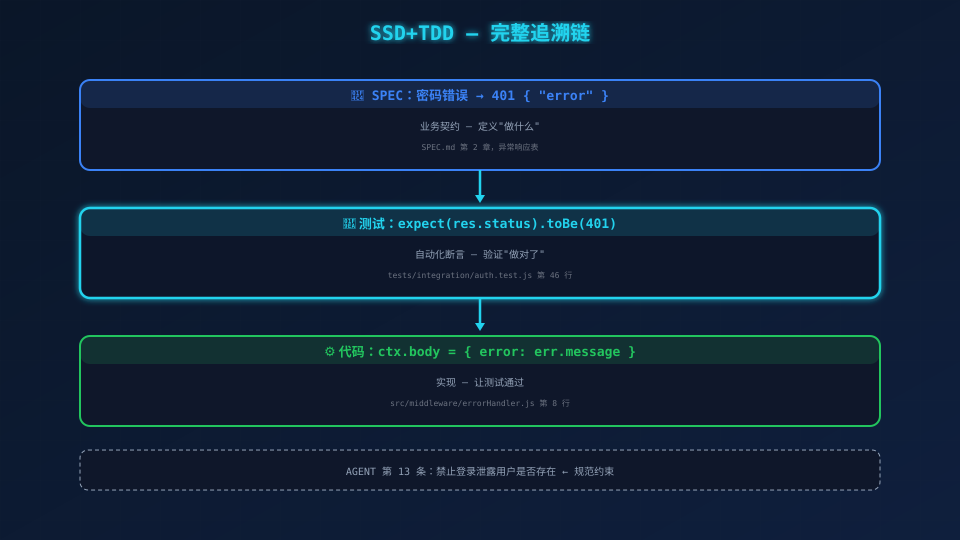
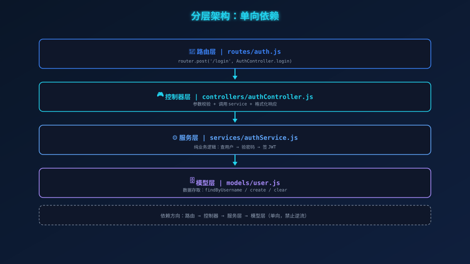

# Iter 4：HTTP 接口层——让登录接口真正可用

> **场景带入 → 发现问题 → 方案迭代 → 原理拆解 → 效果对比 → 情绪升华**

---

## 一、理论：架构分层为什么重要

### 为什么不能把逻辑写在路由里？

很多初学者会这样写：

```javascript
// ❌ 反面教材：业务逻辑散落在路由里
router.post('/login', async (ctx) => {
  const { token } = await AuthService.login(ctx.request.body);
  ctx.body = { token };
});
```

看起来干净。跑一下，好像也能用。

**但你真的敢把这代码上线吗？**

**问题 1：参数呢？** 如果前端没传 `username`，`ctx.request.body.username` 是 `undefined`。`findByUsername(undefined)` 返回 `undefined`，然后 `bcrypt.compare` 直接崩溃，最后返回 500。**但问题是前端传参不规范，不是服务器出错了——你应该返回 400，而不是 500。**

**问题 2：异常呢？** 如果 `AuthService.login` 抛出"密码错误"，Koa 默认的异常处理把它当成 500 返回。**密码错误和服务器宕机，前端收到的是同一个 500——这怎么让客户端区分？**

### 分层架构的核心思想：各司其职

```
HTTP 请求
  │
  ▼
┌──────────────────────┐
│  路由 (Router)       │  ← 把 URL 映射到控制器
├──────────────────────┤
│  控制器 (Controller) │  ← 参数校验 → 调 service → 格式化响应
├──────────────────────┤
│  中间件 (Middleware)  │  ← 跨切面逻辑（错误处理、解析、日志）
├──────────────────────┤
│  服务层 (Service)    │  ← 业务逻辑
├──────────────────────┤
│  模型层 (Model)      │  ← 数据存取
└──────────────────────┘
```

**每一层的职责是唯一的，不可重叠，不可跳过。**

| 层级 | 职责 | 不做什么 |
|------|------|---------|
| 路由 | URL → 控制器映射 | 不处理业务逻辑 |
| 控制器 | 参数校验 → 调 service → 格式化响应 | 不查数据库，不比密码 |
| 中间件 | 跨切面逻辑（错误处理、解析 JSON） | 不含业务逻辑 |
| 服务层 | 业务编排 | 不处理 HTTP 细节 |
| 模型层 | 数据存取 | 不含业务逻辑 |

**为什么分层？因为每一层都可以独立修改而不影响其他层。** 改路由格式不会影响业务逻辑，改错误处理策略不会影响参数校验，改数据库实现不会影响控制器。

---

## 二、本项目实际代码

### 2.1 错误处理器——全局异常处理的"安全气囊"

```javascript
// 文件路径: src/middleware/errorHandler.js
const { AppError } = require('../utils/errors');

function errorHandler(err, ctx) {
  if (err instanceof AppError) {
    ctx.status = err.statusCode;
    ctx.body = { error: err.message };
    return;
  }
  ctx.status = 500;
  ctx.body = { error: '服务器内部错误' };
}

module.exports = errorHandler;
```

**为什么非 `AppError` 不暴露堆栈？** 堆栈信息会暴露系统内部结构——文件路径、函数名、数据库表名——这些是攻击者的情报金矿。**所有非预期的错误，统一吞掉，只返回"服务器内部错误"。**

**为什么 AppError 要暴露错误消息？** 因为业务错误（如"用户名或密码错误"）是前端需要展示给用户的，不属于内部细节。

---

### 2.2 控制器——参数校验的"安检门"

```javascript
// 文件路径: src/controllers/authController.js
const AuthService = require('../services/authService');
const { Errors } = require('../utils/errors');

const AuthController = {
  async login(ctx) {
    const { username, password } = ctx.request.body;
    if (!username || !password) throw Errors.MISSING_PARAMS('用户名和密码不能为空');
    const { token } = await AuthService.login({ username, password });
    ctx.status = 200;
    ctx.body = { token };
  },
};

module.exports = AuthController;
```

**控制器的职责边界清晰到可以用一句话概括：**
- 第 10 行：参数校验（安检门）
- 第 11 行：调 service（业务委托）
- 第 12-13 行：格式化响应（输出统一）

**不做什么？** 不查数据库（那是 model 的事），不比较密码（那是 service 的事），不处理异常（那是 errorHandler 的事）。

---

### 2.3 路由——极简的"交通指示牌"

```javascript
// 文件路径: src/routes/auth.js
const Router = require('koa-router');
const AuthController = require('../controllers/authController');

const router = new Router({ prefix: '/api/auth' });
router.post('/login', AuthController.login);

module.exports = router;
```

路由不包含任何业务逻辑，它只是告诉系统：**"POST /api/auth/login 请求，交给 AuthController.login 处理。"**

---

### 2.4 应用工厂——全局组装

```javascript
// 文件路径: src/app.js
const Koa = require('koa');
const bodyParser = require('koa-bodyparser');
const authRouter = require('./routes/auth');
const errorHandler = require('./middleware/errorHandler');

function createApp() {
  const app = new Koa();
  app.use(bodyParser());
  app.use(async (ctx, next) => {
    try { await next(); }
    catch (err) { errorHandler(err, ctx); }
  });
  app.use(authRouter.routes());
  app.use(authRouter.allowedMethods());
  return app;
}

module.exports = { createApp };
```

**中间件的顺序决定了请求的处理流程：**

| 顺序 | 中间件 | 职责 |
|------|--------|------|
| 1 | `bodyParser()` | 解析 JSON 请求体，填充 `ctx.request.body` |
| 2 | `try-catch` 包装 | 全局安全底线，捕获所有异常 |
| 3 | `authRouter.routes()` | 注册路由 |
| 4 | `authRouter.allowedMethods()` | 自动处理 OPTIONS/405 |

**顺序为什么重要？** `bodyParser` 必须在路由之前，否则路由拿不到 `ctx.request.body`；`try-catch` 必须在路由之前，否则路由抛出的错误无法被捕获。

---

### 2.5 入口——种子数据 + 启动服务

```javascript
// 文件路径: src/index.js
const config = require('./config');
const { createApp } = require('./app');
const { seedDatabase } = require('../scripts/seed');

async function main() {
  await seedDatabase();
  const app = createApp();
  app.listen(config.port, () => {
    console.log(`[server] http://localhost:${config.port}`);
  });
}

main().catch((err) => { console.error(err.message); process.exit(1); });
```

**启动流程：** 先播种默认数据（admin 用户）→ 再创建应用 → 最后监听端口。种子数据在每次启动时自动执行，但幂等——已存在的用户不会重复创建。

---

## 三、集成测试：4 个 Scenario 的完整验证

在动手写代码之前，先写集成测试。**8 条测试，覆盖 SPEC 定义的 4 个 Scenario。**

```javascript
// 文件路径: tests/integration/auth.test.js
const request = require('supertest');
const { createApp } = require('../../src/app');
const { seedDatabase } = require('../../scripts/seed');
const UserModel = require('../../src/models/user');

let app;

beforeEach(async () => {
  UserModel.clear();
  await seedDatabase();
  app = createApp();
});

// ── Scenario 1: 正常登录 ──

describe('Scenario 1: 正常登录', () => {
  it('admin 正确密码应返回 200 和 JWT token', async () => {
    const res = await request(app.callback())
      .post('/api/auth/login')
      .send({ username: 'admin', password: 'admin123' });
    expect(res.status).toBe(200);
    expect(res.body.token).toBeDefined();
    expect(res.body.token.split('.')).toHaveLength(3);
  });

  it('JWT payload 应包含 user_id', async () => {
    const res = await request(app.callback())
      .post('/api/auth/login')
      .send({ username: 'admin', password: 'admin123' });
    const jwt = require('jsonwebtoken');
    const config = require('../../src/config');
    const decoded = jwt.verify(res.body.token, config.jwt.secret);
    expect(decoded.user_id).toBe(1);
  });
});

// ── Scenario 2: 密码错误 ──

describe('Scenario 2: 密码错误', () => {
  it('应返回 401 和错误消息', async () => {
    const res = await request(app.callback())
      .post('/api/auth/login')
      .send({ username: 'admin', password: 'wrongpass' });
    expect(res.status).toBe(401);
    expect(res.body.error).toBe('用户名或密码错误');
  });
});

// ── Scenario 3: 用户不存在 ──

describe('Scenario 3: 用户不存在', () => {
  it('应返回 401', async () => {
    const res = await request(app.callback())
      .post('/api/auth/login')
      .send({ username: 'hacker', password: 'x' });
    expect(res.status).toBe(401);
    expect(res.body.error).toBe('用户名或密码错误');
  });

  it('错误消息与密码错误完全一致（防枚举）', async () => {
    const [wrongPass, notFound] = await Promise.all([
      request(app.callback()).post('/api/auth/login').send({ username: 'admin', password: 'wrong' }),
      request(app.callback()).post('/api/auth/login').send({ username: 'ghost', password: 'x' }),
    ]);
    expect(wrongPass.body).toEqual(notFound.body);
  });
});

// ── Scenario 4: 参数缺失 ──

describe('Scenario 4: 参数缺失', () => {
  it('缺少 username 应返回 400', async () => {
    const res = await request(app.callback())
      .post('/api/auth/login')
      .send({ password: 'admin123' });
    expect(res.status).toBe(400);
    expect(res.body.error).toBe('用户名和密码不能为空');
  });

  it('缺少 password 应返回 400', async () => {
    const res = await request(app.callback())
      .post('/api/auth/login')
      .send({ username: 'admin' });
    expect(res.status).toBe(400);
    expect(res.body.error).toBe('用户名和密码不能为空');
  });

  it('两个字段都缺失应返回 400', async () => {
    const res = await request(app.callback())
      .post('/api/auth/login')
      .send({});
    expect(res.status).toBe(400);
    expect(res.body.error).toBe('用户名和密码不能为空');
  });
});
```

### 4 个 Scenario 的测试策略

| Scenario | 测试条数 | 验证点 |
|----------|---------|--------|
| 正常登录 | 2 | 200 + token 格式 + JWT payload 完整性 |
| 密码错误 | 1 | 401 + 错误消息 |
| 用户不存在 | 2 | 401 + 与密码错误消息完全一致（防枚举） |
| 参数缺失 | 3 | 缺 username / 缺 password / 都缺 → 400 |

**第 3 个 Scenario 的并发测试：** `Promise.all` 同时发送密码错误和用户不存在的请求，用 `toEqual` 断言两条响应体完全一致。这是防枚举攻击的护栏——攻击者无法通过错误消息差异来推断有效用户名。

---

## 四、验证：全部通过

```bash
$ npx jest tests/integration/auth.test.js
Tests: 8 passed, 8 total ✅
```

8 条集成测试，覆盖 4 个 Scenario，全部通过。

跑整个测试套件：

```bash
$ npm test
Test Suites: 6 passed, 6 total
Tests:       30 passed, 30 total ✅
```

**30 条测试，全部通过。** 从 Iter 1 的单元测试到 Iter 4 的集成测试——所有代码都在测试的护城河之内。

---

## 五、架构追踪链



**从 SPEC 到代码到测试的完整路径：**

```
SPEC: 参数缺失 → 返回 400
  ↓ 测试实现
auth.test.js: 缺少 username 应返回 400 → expect(res.status).toBe(400)
  ↓ 代码实现
authController.js: if (!username || !password) throw Errors.MISSING_PARAMS(...)
  ↓ 异常处理
errorHandler.js: if (err instanceof AppError) { ctx.status = err.statusCode; ... }
```

每一层都是独立的，可替换的，可测试的——这就是分层架构的终极价值。



---

## 六、进入 Iter 5

代码写完了。HTTP 接口层有了，控制器有了，错误处理有了，集成测试有了。

最后一个迭代——**完整验证 + 回顾**。

```
Tests: 30 passed, 30 total ✅
```

---

*下一篇：09-Iter 5——完整验证 + 回顾。*