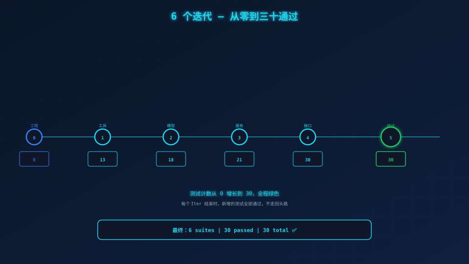
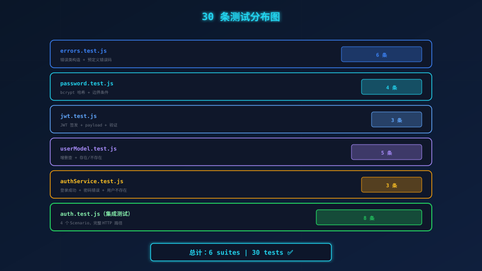

# Iter 5：完整验证 + 回顾——30 条测试全部通过

> **场景带入 → 发现问题 → 方案迭代 → 原理拆解 → 效果对比 → 情绪升华**

---

> **最后一个迭代：不写新代码。只做一件事——让 30 条测试全部绿。**
>
> **如果你跳过前面的步骤直接在这里打开终端，请先确保：**
>
> ```bash
> npm install
> cp .env.example .env    # 如果还没配置
> ```
>
> **然后输入：**
>
> ```bash
> npm test
> ```

---

## 一、理论：完整验证的价值与回归测试的意义

### 为什么"手工测了两个例子"不够？

写完了功能。手动 curl 了两下。返回了正确的 JSON。

你关掉终端。长吁一口气。告诉自己"做完了"。

**但你心里清楚：你只测了最常用的那一条路。**

- 密码错误你试了——但用户不存在呢？响应体和密码错误完全一样吗？
- 参数完整你测了——但少传 `username` 呢？少传 `password` 呢？两个都为空字符串呢？
- Token 返回了你看到了——但 payload 里真的有 `user_id` 吗？24 小时后会过期吗？签名被篡改你能检测到吗？

**这些"万一"，一个都没测。**

这就引出了**完整验证**的必要性：把 SPEC 定义的所有 Scenario、所有边界条件、所有异常路径，交给机器一次性验证。

### 回归测试的意义

**回归测试不是"证明你写对了"，而是"证明别人没改坏"。**

三个月后，一个新同事接手这段代码。他改了 `authController.js`：

```javascript
// 旧：ctx.body = { token };
// 新：ctx.body = { data: { token }, code: 200 };   ← "我觉得这样更规范"
```

一跑测试：

```
Scenario 1: 正常登录
  ✕ admin 正确密码应返回 200 和 JWT token
    Expected res.body.token to be defined
    Received: undefined
```

**2 分钟就知道改坏了什么。**

- ❌ 不需要手动 curl
- ❌ 不需要问同事"这个接口格式是什么"
- ❌ 不需要等 QA 测出来
- ❌ 不需要上线之后崩溃

**这就是 30 条测试的真正价值：不是"证明一次正确"，而是"永远正确"。**

---

## 二、npm test 真实输出

```bash
$ npm test
PASS tests/unit/errors.test.js
PASS tests/unit/password.test.js
PASS tests/unit/jwt.test.js
PASS tests/unit/userModel.test.js
PASS tests/unit/authService.test.js
PASS tests/integration/auth.test.js

Test Suites: 6 passed, 6 total
Tests:       30 passed, 30 total
```

**2.2 秒。30 条测试。全部通过。**

每个测试套件的详细分布：

| 测试文件 | 数量 | 守护什么 |
|---------|------|---------|
| `tests/unit/errors.test.js` | 6 | 错误类构造、预定义错误码、堆栈捕获 |
| `tests/unit/password.test.js` | 4 | bcrypt 哈希、密码长度边界、验证匹配 |
| `tests/unit/jwt.test.js` | 3 | Token 签发格式、payload 完整性、过期验证 |
| `tests/unit/userModel.test.js` | 6 | 用户增删查、存在/不存在、清空重置 |
| `tests/unit/authService.test.js` | 3 | 登录成功、密码错误、用户不存在（同一个错误） |
| `tests/integration/auth.test.js` | 8 | 4 个 Scenario 的 HTTP 完整路径 + 边界条件 |

---

## 三、追查链：SPEC → 测试 → 代码 → AGENT

我们沿着"密码错误"这条路径，从 SPEC 到 AGENT 完整追查一遍。

### 第 1 层：SPEC——契约

```yaml
# 文件路径: SPEC.md
### Scenario 2: 密码错误
- Given 数据库中存在用户 admin
- When 用户提交正确的用户名但错误的密码
- Then 返回 401
- And 响应体为 `{ "error": "用户名或密码错误" }`
```

**这是业务方的承诺：API 长这样，客户端按这个格式解析。**

### 第 2 层：测试——门禁

```javascript
// 文件路径: tests/integration/auth.test.js
it('应返回 401 和错误消息', async () => {
  const res = await request(app.callback())
    .post('/api/auth/login')
    .send({ username: 'admin', password: 'wrongpass' });

  expect(res.status).toBe(401);
  expect(res.body.error).toBe('用户名或密码错误');
});
```

**这是一道自动化门禁：SPEC 里的每一个"Then"，都有对应的 `expect` 在蹲守。**

### 第 3 层：代码——实现

```javascript
// 文件路径: src/controllers/authController.js
async login(ctx) {
  const { username, password } = ctx.request.body;
  if (!username || !password) throw Errors.MISSING_PARAMS('用户名和密码不能为空');
  const { token } = await AuthService.login({ username, password });
  ctx.status = 200;
  ctx.body = { token };
}
```

控制器调 service，service 抛异常，errorHandler 统一处理格式。

### 第 4 层：AGENT——规范

```markdown
# 文件路径: AGENT.md
## 禁止事项
| 禁止 | 原因 |
|------|------|
| 登录泄露用户是否存在 | 防枚举攻击 |
```

**这是比测试更早的约束：在写任何代码之前，AGENT 就已经写死了"你不能做什么"。**

### 追查链闭环

```
SPEC 说：密码错误返回 401 { error }
  ↓ 测试检验
auth.test.js: expect(res.status).toBe(401)
  ↓ 代码实现
authService.js: throw Errors.INVALID_CREDENTIALS
  ↓ 异常处理
errorHandler.js: ctx.body = { error: err.message }
  ↓ 规范约定
AGENT.md 第 28 行：禁止登录泄露用户是否存在
```

这条链意味着什么？

- **改 SPEC** → 测试立刻报错（契约变了，门禁没更新）
- **改测试** → 代码逻辑对不上（红在 CI）
- **改代码** → AGENT 的规范作为最后一道防线（如果忘了写测试，至少 AGENT 还在）

**三层，层层锁定。这不是"以防万一"，这是"万无一失"。**

---

## 四、手动 curl 验证——4 个 Scenario

启动服务：

```bash
npm run dev
```

在另一个终端验证 4 个 Scenario：

```bash
# ═════ Scenario 1: 正常登录 ═════
curl -X POST http://localhost:3000/api/auth/login \
  -H "Content-Type: application/json" \
  -d '{"username":"admin","password":"admin123"}'
# → {"token":"eyJhbGciOiJIUzI1NiIs..."}

# ═════ Scenario 2: 密码错误 ═════
curl -X POST http://localhost:3000/api/auth/login \
  -H "Content-Type: application/json" \
  -d '{"username":"admin","password":"wrongpass"}'
# → {"error":"用户名或密码错误"}

# ═════ Scenario 3: 用户不存在 ═════
curl -X POST http://localhost:3000/api/auth/login \
  -H "Content-Type: application/json" \
  -d '{"username":"ghost","password":"x"}'
# → {"error":"用户名或密码错误"}   ← 和 Scenario 2 完全一样！

# ═════ Scenario 4: 参数缺失 ═════
curl -X POST http://localhost:3000/api/auth/login \
  -H "Content-Type: application/json" \
  -d '{}'
# → {"error":"用户名和密码不能为空"}
```

**手动验证 vs 自动测试的对比：**

| 对比维度 | 手动 curl | 自动化测试 |
|----------|----------|-----------|
| 耗时 | ~5 分钟 | ~2 秒 |
| 覆盖率 | 4 个例子 | 30 条断言 |
| 重复性 | 每次手动 | 一键重现 |
| 回归价值 | 低 | 高（每次代码变更自动校验） |

**看到结论了吗？** 手动 curl 验证了你熟悉的那几条路；自动测试验证了 **每一个你想到的和没想到的边界条件**。

---

## 五、每个迭代的测试数增长表

从 Iter 0 到 Iter 5，测试数稳步增长：

| 迭代 | 新增文件 | 新增测试 | 累计测试 | 里程碑 |
|------|---------|---------|---------|--------|
| Iter 0 | SPEC / PLAN / AGENT / 脚手架 | 0 | **0** | 搭好框架，想清楚再动手 |
| Iter 1 | errors.js / password.js / jwt.js | 13 | **13** | 工具函数层全部锁定 |
| Iter 2 | config / UserModel / seed.js | 5 | **18** | 数据模型 + 种子数据 |
| Iter 3 | authService.js | 3 | **21** | 业务逻辑验证 |
| Iter 4 | controller / router / middleware / app | 9 | **30** | HTTP 接口层集成测试 |
| Iter 5 | 无新代码 | 0 | **30** | 完整验证，全部通过 |

**关键数据：**

```
Iter 0:  0  →  0  （规划）
Iter 1:  0  → 13  （+13，工具函数）
Iter 2: 13  → 18  （+5，数据模型）
Iter 3: 18  → 21  （+3，服务层）
Iter 4: 21  → 30  （+9，HTTP 接口层）
Iter 5: 30  → 30  （全绿 ✅）
```

**每个 Iter 结束时，测试数都在增加，但全部是绿色。** 这不是巧合——每条测试都是在写代码之前就规划好的，每个边界条件都是 SPEC 提前定义的。

---

## 六、迭代里程碑可视化



**这条增长曲线的背后：**

13 条单元测试（Iter 1）→ 6 个工具函数的每个边界条件都有断言
5 条模型测试（Iter 2）→ 用户增删查 + 种子幂等性
3 条服务测试（Iter 3）→ Mock 隔离的业务逻辑验证
9 条 HTTP 测试（Iter 4）→ 真正的 HTTP 请求 + 完整响应断言
0 条新测试（Iter 5）→ 验证全部 30 条仍然是绿色

**这就是 SDD + TDD 的节奏：先规划→再分层实现→每一步都锁死→最后全量验证。**

---

## 七、测试分布



**30 条测试的层次结构：**

| 层级 | 测试类型 | 条数 | 依赖 |
|------|---------|------|------|
| 工具函数 | 纯单元测试 | 13 | 无外部依赖 |
| 数据模型 | 单元测试 | 6 | 内存数据 |
| 服务层 | Mock 测试 | 4 | Mock 模型 |
| HTTP 接口 | 集成测试 | 7 | 完整 Koa 栈 |

**注意底层的测试数永远大于上层。** 这是合理的——基础层的每个边界条件都需要独立验证，而上层的集成测试只需验证组合逻辑。

---

## 八、一个月后——测试的真正价值

当项目进入维护期，测试的价值才会真正显现。

**情景一：加字段（向后兼容）**

新同事改完 `authController.js`：

```javascript
// 旧：ctx.body = { token };
// 新：ctx.body = { token, expires_in: config.jwt.expiresIn };
```

跑测试：**全部通过。** 没有破坏现有契约，改进是安全的。

**情景二：改格式（破坏性变更）**

```javascript
// 旧：{ token }
// 新：{ data: { token }, code: 200 }
```

跑测试：

```
✕ admin 正确密码应返回 200 和 JWT token
  Expected res.body.token to be defined
  Received: undefined
```

**2 分钟就知道改坏了什么。** 不需要手动 curl，不需要等 QA 测出来，不需要上线之后崩溃。

---

## 九、回顾：你学会了怎么设计代码

站在这里往回看，你做了什么？

**你不是写了 12 个文件、30 条测试、6 个迭代。**

**你是学会了一种设计代码的方式：**

1. **先写 SPEC**：把需求变成契约，而不是对话记录
2. **再写 PLAN**：把任务排成迭代，每个迭代结束都有里程碑
3. **再写 AGENT**：把规范写成门禁，不是靠记忆力而是靠文件
4. **再写测试**：把"人工验证"升级为"自动化门禁"
5. **再写代码**：让每一行代码都有对应的约束

**这套方法论有一个名字：SDD（Spec-Driven Development）+ TDD（Test-Driven Development）。**

它不适合所有项目——一个 3 天的原型不需要 30 条测试。**但对于任何"要上线、要维护、要交接"的项目，这套流程是把不确定性降到最低的方法。**

六个月后，你不会记得 `app.js` 里 `bodyParser` 和 `try-catch` 的顺序。

但你会记得：**先想清楚，再做。做对了，再改。改完了，还有测试帮你守着。**

---

> **全文完。**
>
> 从 Iter 0 的空白文件，到 Iter 5 的 30 条测试全部通过，这条路你走完了。
>
> 你在 6 个迭代里学会了：
> - 如何用 SPEC 把需求写成不会模棱两可的契约
> - 如何用 PLAN 把大任务切成可交付的小步骤
> - 如何用 AGENT 把规范写成不可突破的门禁
> - 如何用 TDD 让每一行代码都有对应测试
> - 如何用分层架构让每个组件各司其职
>
> **你不再只是"写代码的人"——你是"设计代码的人"。**
>
> 如果你愿意，这个故事可以从这里继续——用同样的方法写下一个模块。框架已经搭好了，门禁已经打开了，你需要的只是再写一本 SPEC。
>
> **下一篇：没有下一篇了。你站在了起点。**